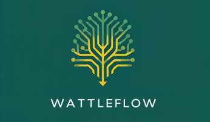

# Wattleflow documentation

---
**WattleFlow** — graceful flow,
modular, scaled with purpose,
patterns guide the stream,
extensible, clear design,
built to last and grow.
---

| Characteristic           | Value                                                                   |
| ------------------------ | ----------------------------------------------------------------------- |
| **Version**              | v0.1 |
| **License**              | © 2022–2026 WattleFlow. All rights reserved. |
| **Documentation**        | [**Wattleflow Documentation**](https://github.com/wattleflow/documentation.git) |

## Contents (volumes)

| Volume | Title | Location |
|---|---|---|
| I | Foundations | [PHILOSOPHY](PHILOSOPHY.md) · [DOCTRINE](DOCTRINE.md) · [METHODOLOGY](METHODOLOGY.md) · [POSTULATE](POSTULATE.md) · [LITERATURE](LITERATURE.md) |
| II | Architectural Principles | *(planned)* |
| III | Decision Records | [`04-DR/`](04-DR/) — [WFL](04-DR/DR-WFL-INDEX.md) · [COR](04-DR/DR-COR-INDEX.md) · [PRC](04-DR/DR-PRC-INDEX.md) *(active)* |
| IV | System Design | *(planned)* |
| V | Development Standards | [`01-HLRQ/`](01-HLRQ/HLRQ-000-EN.md) · [`02-FRQ/`](02-FRQ/FRQ-000-EN.md) · [`03-NFRQ/`](03-NFRQ/NFRQ-000-EN.md) *(in progress)* |
| VI | Quality Assurance | *(planned)* |
| VII | AI-Assisted Software Engineering | *(planned)* |
| VIII | Governance, Compliance and Information Science | *(planned)* |

## Where things live

| Layer | Artefact |
|---|---|
| Philosophy (umbrella) | [PHILOSOPHY.md](PHILOSOPHY.md) |
| Norms (registry, 9 articles) | [DOCTRINE.md](DOCTRINE.md) |
| Claims (registry `P-01…P-21`) | [POSTULATE.md](POSTULATE.md) |
| References (append-only, keys 1–64) | [LITERATURE.md](LITERATURE.md) |
| Method (Volume I) | [METHODOLOGY.md](METHODOLOGY.md) · [`05-METHOD/`](05-METHOD/dqi.md) |
| Policy | [CLAUDE.md](CLAUDE.md) (= `POLICY.md`) |
| Discourse vocabulary | [dictionary.yaml](dictionary.yaml) → [DICTIONARY.md](DICTIONARY.md) |
| Requirements | [`01-HLRQ/`](01-HLRQ/HLRQ-000-EN.md) · [`02-FRQ/`](02-FRQ/FRQ-000-EN.md) · [`03-NFRQ/`](03-NFRQ/NFRQ-000-EN.md) |
| Analyses · change records | [`06-ANALYSIS/`](06-ANALYSIS/) · [`07-CHANGES/`](07-CHANGES/) |
| Conformance snapshots | [`workflow/conformance/`](workflow/conformance/) |
| Worklist (state of work, not norm) | [`workflow/TODO.md`](workflow/TODO.md) · [`workflow/DONE.md`](workflow/DONE.md) |

**Language.** The source language is Croatian until v1.0 (`CLAUDE.md` §3.2); English editions
that already exist before that point are a declared divergence, not an approved translation —
see the note in `CLAUDE.md` §3.2.

**Local repository.** Pushing to `origin` is deliberately disabled; only the UK English edition
is published, at v1.0, as a separate deliberate act (`CLAUDE.md` §8).
