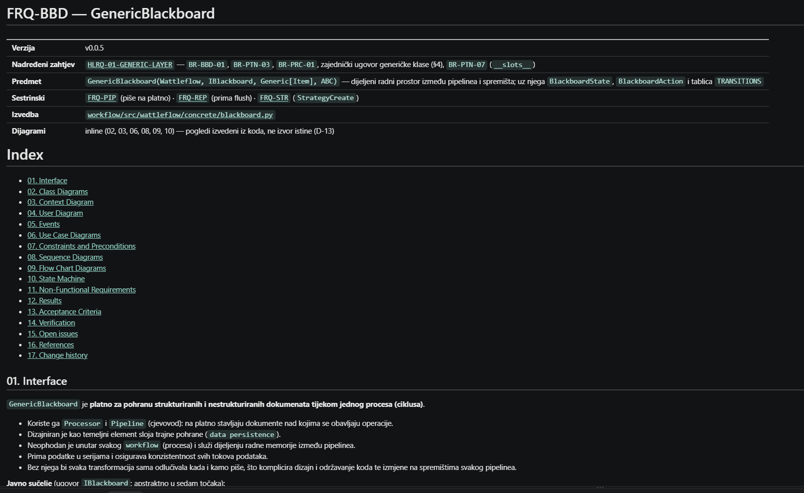
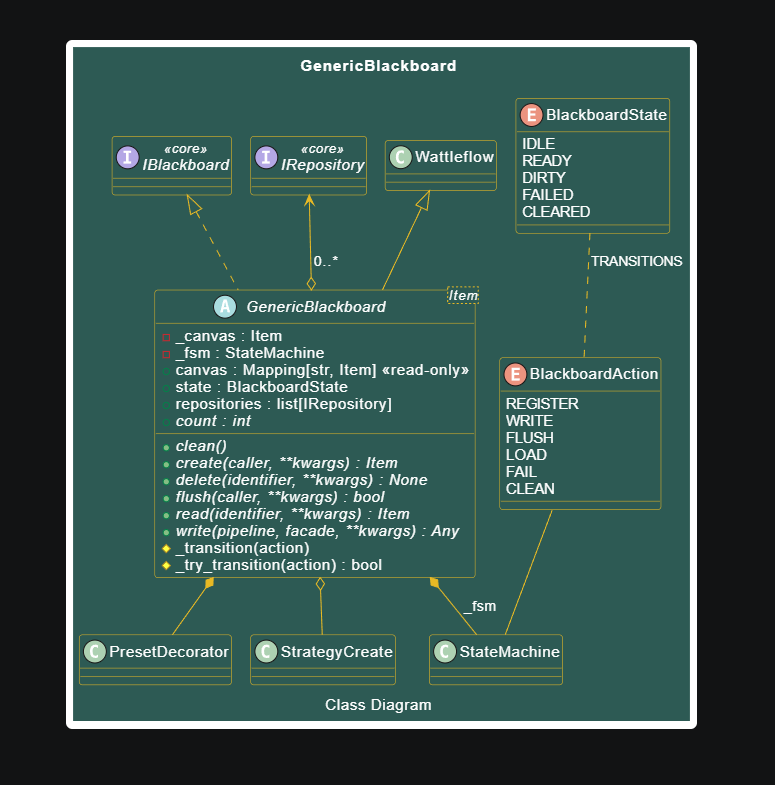
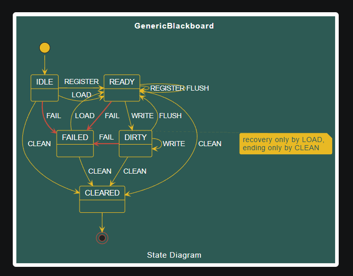
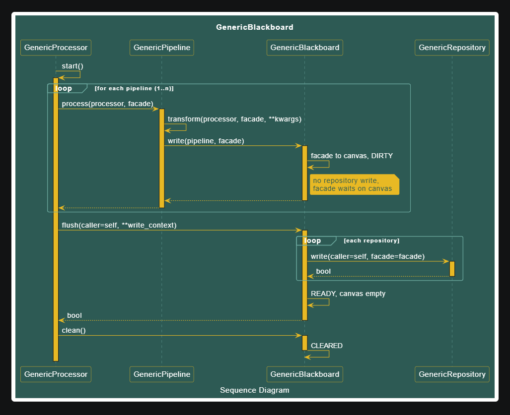
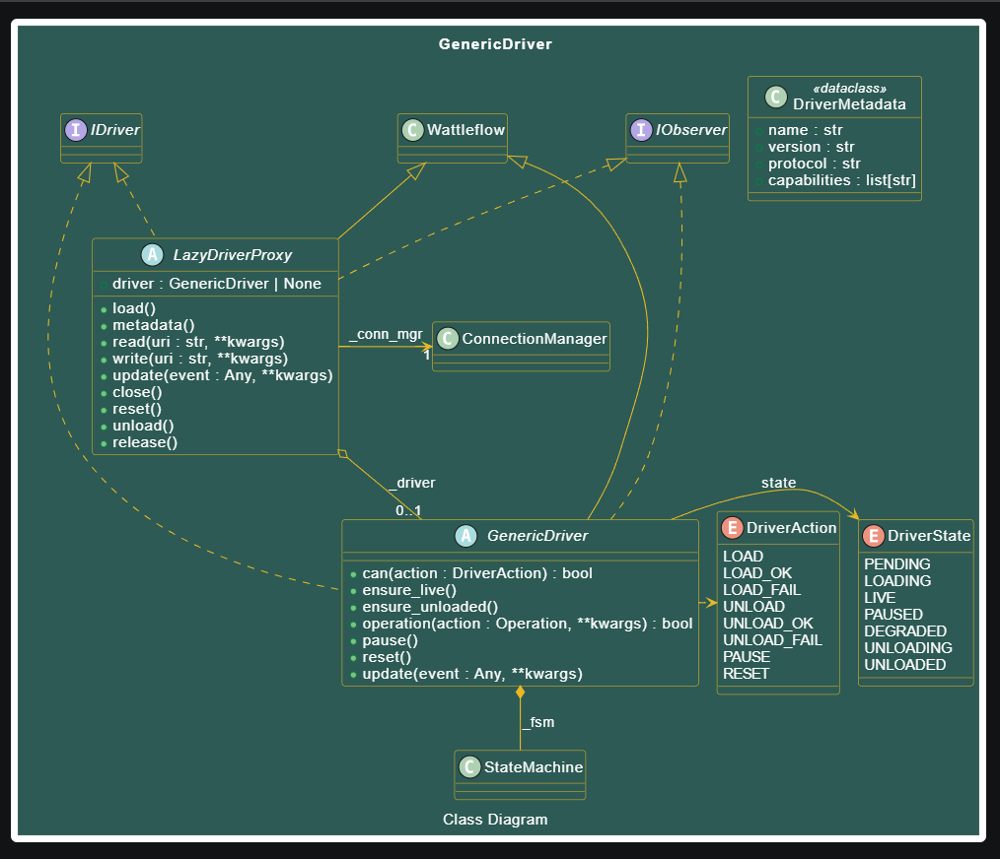
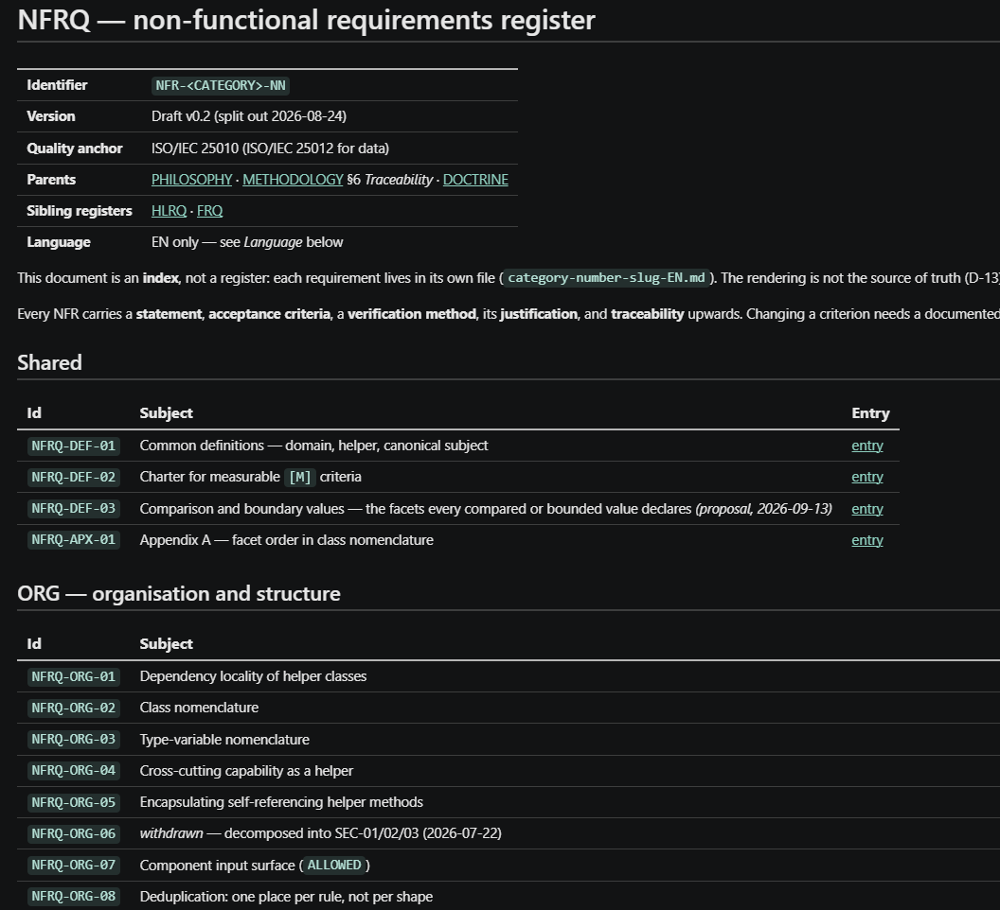
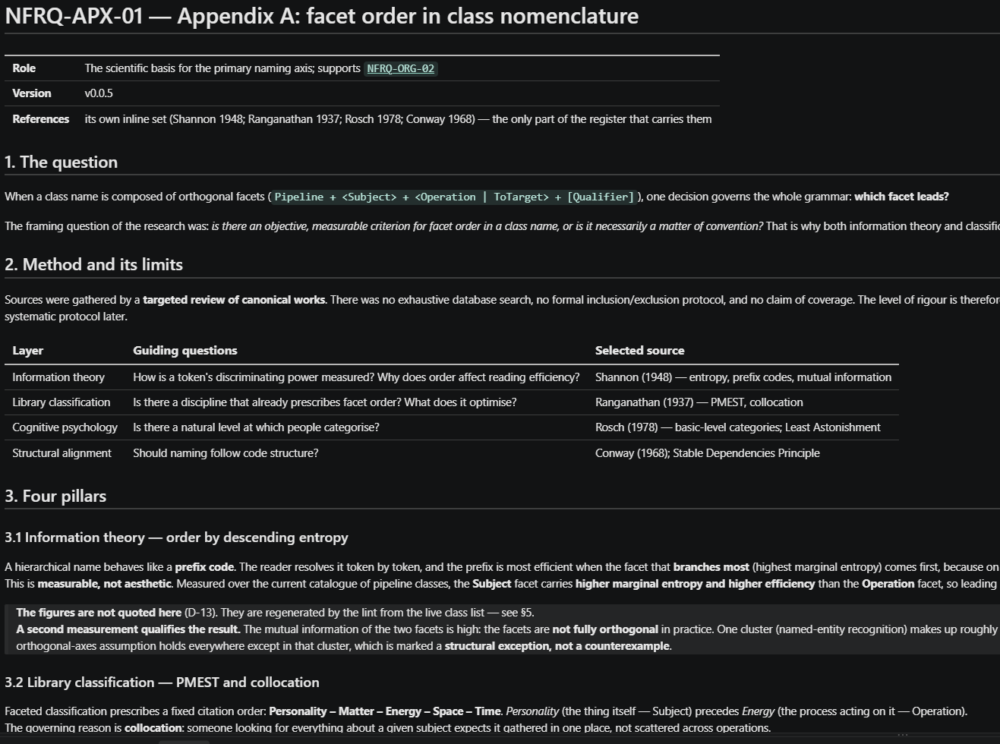

# Wattleflow documentation

---
**WattleFlow** — graceful flow,
modular, scaled with purpose,
patterns guide the stream,
extensible, clear design,
built to last and grow.
---

| Characteristic           | Value                                                                   |
| ------------------------ | ----------------------------------------------------------------------- |
| **Version**              | v0.1 |
| **License**              | © 2022–2026 WattleFlow. All rights reserved. |
| **Documentation**        | [**Wattleflow Documentation**](https://github.com/wattleflow/documentation.git) |

## Contents (volumes)

| Volume | Title | Location |
|---|---|---|
| I | Foundations | [PHILOSOPHY](PHILOSOPHY.md) · [DOCTRINE](DOCTRINE.md) · [METHODOLOGY](METHODOLOGY.md) · [POSTULATE](POSTULATE.md) · [LITERATURE](LITERATURE.md) |
| II | Architectural Principles | *(planned)* |
| III | Decisions | carried by the requirement documentation (`requirements/01-HLRQ/`–`03-NFRQ/`) |
| IV | System Design | *(planned)* |
| V | Development Standards | [`requirements/01-HLRQ/`](requirements/01-HLRQ/HLRQ-00-INDEX.md) · [`requirements/02-FRQ/`](requirements/02-FRQ/FRQ-000-INDEX.md) · [`requirements/03-NFRQ/`](requirements/03-NFRQ/NFRQ-000-INDEX.md) *(in progress)* |
| VI | Quality Assurance | *(planned)* |
| VII | AI-Assisted Software Engineering | *(planned)* |
| VIII | Governance, Compliance and Information Science | *(planned)* |

## Where things live

| Layer | Artefact |
|---|---|
| Philosophy (umbrella) | [PHILOSOPHY.md](PHILOSOPHY.md) |
| Norms (registry, 9 articles) | [DOCTRINE.md](DOCTRINE.md) |
| Claims (registry `P-01…P-23`) | [POSTULATE.md](POSTULATE.md) |
| References (append-only, keys 1–69) | [LITERATURE.md](LITERATURE.md) |
| Method (Volume I) | [METHODOLOGY.md](METHODOLOGY.md) · `requirements/05-METHODS/` |
| Policy (cascade) | `CLAUDE.md` (= `POLICY.md`) → `STANDARDS.md` · `DOCUMENTATION.md` · `ARCHITECTURE.md` · `DECISIONS.md` · `CONFORMANCE.md` |
| Discourse vocabulary | [dictionary.yaml](dictionary.yaml) → [DICTIONARY.md](DICTIONARY.md) · `GLOSSARY.md` (en-AU, generated) |
| Requirements | [`requirements/01-HLRQ/`](requirements/01-HLRQ/HLRQ-00-INDEX.md) · [`requirements/02-FRQ/`](requirements/02-FRQ/FRQ-000-INDEX.md) · [`requirements/03-NFRQ/`](requirements/03-NFRQ/NFRQ-000-INDEX.md) |
| Analyses · change records | `requirements/06-ANALYSIS/` · `requirements/07-CHANGES/` |
| Diagram register (drawn · reserved) | [`requirements/DIAGRAMS.md`](requirements/DIAGRAMS.md) |
| Per-distribution documentation | `core/` · `workflow/` · `blackwattle/` |
| Conformance snapshots | `workflow/conformance/` |
| Worklist (state of work, not norm) | `workflow/TODO.md` · `workflow/DONE.md` |

**What this published edition contains — and what it does not.** From 2026-09-09 the repository
is published, superseding the earlier local-only lock (`DECISIONS.md` §8, still to be reconciled). The published set is the **doctrinal layer and the requirement
registers** only. Deliberately not published: the dated analyses
(`requirements/06-ANALYSIS/`), the alignment records (`requirements/07-CHANGES/`), the method documents (`requirements/05-METHODS/`) and
the worklist.

**Declared consequence (D-11).** Links in the published texts that point into those
unpublished trees do not resolve here. This is stated rather than hidden: an unresolvable
reference is a known cost of the publication scope, not an error in the text, and the traceability
it records still holds in the full tree.

---

## Showcase — requirements you can read, trace and verify

WattleFlow is documented the way it is built: every capability starts as a **requirement**, is
described by diagrams drawn from the code, is tested against stated **acceptance criteria**, and
carries its own change history. Nothing here is marketing copy written after the fact — the
records below are the working documents of the framework.

| | |
|---|---|
| **24** functional records | one per building block of the generic layer (workflow, processor, pipeline, blackboard, repository, driver …) |
| **42** non-functional records | organisation, security (17), observability, performance, memory, functional quality |
| **17 sections** per record | interface, class, context, use case, sequence, flow, state, constraints, acceptance criteria, verification, open issues, change history |
| **Traceable** | high-level requirement → functional record → code → test, in both directions |
| **Anchored in standards** | ISO/IEC/IEEE 29148 (requirements), ISO/IEC 25010 (quality) |

### One record, from page to diagram

Every functional record has the same shape, so a reader who knows one knows them all. The record
for the shared canvas between pipelines and repositories (`FRQ-BBD`) opens with its parent
requirement, its subject and its siblings, then a seventeen-section index.

  

### Structure, behaviour, life cycle

The same record explains the component three ways: **what it is made of**, **who talks to whom
and in what order**, and **which states it can be in and what moves it between them**.

  
  

  

The sequence shows the contract in one view: pipelines only write to the canvas; the processor
decides when to flush; the blackboard hands the item to **every** registered repository and then
clears itself.

### Substitutable by design

Drivers reach external systems through a lazy proxy with a guarded life cycle, so a workflow can
swap one backend for another without touching the processing code.

  

### Quality is a register, not an afterthought

Security, observability, performance and organisation rules are written as numbered, individually
verifiable records (`NFRQ-SEC-01` … `NFRQ-SEC-17`, `NFRQ-OBS-01` … `04`, and more) and are cited
by the functional records that must satisfy them. Even the naming of classes has a documented,
research-based rationale.

  
  

### Start reading

- [Functional requirements register](requirements/02-FRQ/FRQ-000-INDEX.md)
- [Non-functional requirements register](requirements/03-NFRQ/NFRQ-000-INDEX.md)
- [High-level requirements](requirements/01-HLRQ/HLRQ-00-INDEX.md)
- [Philosophy](PHILOSOPHY.md) · [Doctrine](DOCTRINE.md) · [Methodology](METHODOLOGY.md)
