# wattleflow.core — interface index

> **Generated view, not a source of truth (D-13).** Produced by `tools/core_index.py 1.1.0` from the docstrings in `src/wattleflow/core/`. Do not edit by hand; regenerate.

Interfaces: 86. Every name below is exported from `wattleflow.core`.

## Contents

### Framework root (`framework`)

| interface | role | inherits |
|---|---|---|
| [`IWattleflow`](#iwattleflow) | root abstract interface of the framework | `ABC` |

### Creational patterns (`creational`)

| interface | role | inherits |
|---|---|---|
| [`IBuilder`](#ibuilder) | Builder abstract interface | `IWattleflow, ABC` |
| [`ICreator`](#icreator) | Factory Method (creator role) abstract interface | `IWattleflow, ABC` |
| [`IFactory`](#ifactory) | Abstract Factory abstract interface | `IWattleflow, ABC` |
| [`IProduct`](#iproduct) | Factory Method (product role) abstract interface | `IWattleflow, ABC` |
| [`IPrototype`](#iprototype) | Prototype abstract interface | `IWattleflow, ABC` |

### Structural patterns (`structural`)

| interface | role | inherits |
|---|---|---|
| [`IAbstraction`](#iabstraction) | Bridge (abstraction role) abstract interface | `IWattleflow, ABC` |
| [`IAdaptee`](#iadaptee) | Adapter (adaptee role) abstract interface | `IWattleflow, ABC` |
| [`IAdapter`](#iadapter) | Adapter (adapter role) abstract interface | `IWattleflow, ABC` |
| [`IComponent`](#icomponent) | **(role not declared)** | `IWattleflow, Generic[Element], ABC` |
| [`IComposite`](#icomposite) | **(role not declared)** | `IComponent[Element], ABC` |
| [`IDecorator`](#idecorator) | **(role not declared)** | `IComponent[Element], ABC` |
| [`IFacade`](#ifacade) | Facade abstract interface | `IWattleflow, ABC` |
| [`IFlyweight`](#iflyweight) | **(role not declared)** | `IWattleflow, Generic[Extrinsic], ABC` |
| [`IFlyweightFactory`](#iflyweightfactory) | Flyweight (factory role) abstract interface | `IWattleflow, ABC` |
| [`IImplementor`](#iimplementor) | Bridge (implementor role) abstract interface | `IWattleflow, ABC` |
| [`IProxy`](#iproxy) | Proxy abstract interface | `IWattleflow, ABC` |
| [`ITarget`](#itarget) | Adapter (target role) abstract interface | `IWattleflow, ABC` |

### Behavioural patterns (`behavioural`)

| interface | role | inherits |
|---|---|---|
| [`IAsyncAggregate`](#iasyncaggregate) | Asynchronous Iterator (aggregate role) abstract interface | `IWattleflow, Generic[Element], ABC` |
| [`IAsyncIterator`](#iasynciterator) | Asynchronous Iterator abstract interface | `IWattleflow, AsyncIterator[Element], ABC` |
| [`IColleague`](#icolleague) | Mediator (colleague role) abstract interface | `IWattleflow, ABC` |
| [`ICommand`](#icommand) | Command abstract interface | `IWattleflow, ABC` |
| [`IElement`](#ielement) | Abstract interface for elements that accept visitors | `IWattleflow, ABC` |
| [`IExpression`](#iexpression) | Interpreter abstract interface | `IWattleflow, Generic[Context, Result], ABC` |
| [`IHandler`](#ihandler) | Chain of Responsibility abstract interface | `IWattleflow, ABC` |
| [`IInvoker`](#iinvoker) | Command (invoker role) abstract interface | `IWattleflow, ABC` |
| [`IIterator`](#iiterator) | Iterator abstract interface | `IWattleflow, Iterator[Element], ABC` |
| [`ILogger`](#ilogger) | Logger abstract interface | `IObservable, ABC` |
| [`IMediator`](#imediator) | Mediator abstract interface | `IWattleflow, ABC` |
| [`IMemento`](#imemento) | Memento abstract interface | `IWattleflow, Generic[State], ABC` |
| [`IObservable`](#iobservable) | Observer / Reactive Programming abstract interface | `IWattleflow, ABC` |
| [`IObserver`](#iobserver) | Observer abstract interface | `IWattleflow, ABC` |
| [`IOriginator`](#ioriginator) | Memento (originator role) abstract interface | `IWattleflow, Generic[State], ABC` |
| [`IState`](#istate) | State abstract interface | `IWattleflow, ABC` |
| [`IStateContext`](#istatecontext) | State (context role) abstract interface | `IWattleflow, ABC` |
| [`IStateMachine`](#istatemachine) | State Machine abstract interface | `IWattleflow, ABC` |
| [`IStrategy`](#istrategy) | Strategy abstract interface | `IWattleflow, ABC` |
| [`IStrategyContext`](#istrategycontext) | Strategy (context role) abstract interface | `IWattleflow, ABC` |
| [`ISyncAggregate`](#isyncaggregate) | Iterator (aggregate role) abstract interface | `IWattleflow, Generic[Element], ABC` |
| [`ITemplate`](#itemplate) | The template method defining the steps of the process | `IWattleflow, ABC` |
| [`IVisitor`](#ivisitor) | Abstract interface for Visitor pattern | `IWattleflow, ABC` |

### Transactional and data patterns (`transactional`)

| interface | role | inherits |
|---|---|---|
| [`IBlackboard`](#iblackboard) | Blackboard (blackboard role) abstract interface | `IWattleflow, ABC` |
| [`IConfig`](#iconfig) | Read-only hierarchical configuration source | `IWattleflow, ABC` |
| [`IDocument`](#idocument) | **(role not declared)** | `IAdaptee, Generic[Content], ABC` |
| [`IDriver`](#idriver) | Resource driver abstract interface | `IWattleflow, ABC` |
| [`IEvent`](#ievent) | Event-Driven (event) abstract interface | `IWattleflow, ABC` |
| [`IEventListener`](#ieventlistener) | Event-Driven (listener role) abstract interface | `IWattleflow, ABC` |
| [`IEventSource`](#ieventsource) | Event-Driven (source role) abstract interface | `IWattleflow, Generic[Event], ABC` |
| [`IFormatter`](#iformatter) | Serialisation abstract interface | `IWattleflow, Generic[Content], ABC` |
| [`IModule`](#imodule) | Blackboard (knowledge-source role) abstract interface | `IWattleflow, ABC` |
| [`IParser`](#iparser) | Deserialisation abstract interface | `IWattleflow, Generic[Content], ABC` |
| [`IPipeline`](#ipipeline) | Pipeline abstract interface | `IWattleflow, ABC` |
| [`IProcessor`](#iprocessor) | Processor abstract interface | `IWattleflow, Generic[Item], ABC` |
| [`IQuery`](#iquery) | Query Object abstract interface | `IWattleflow, Generic[Result], ABC` |
| [`IRepository`](#irepository) | Repository abstract interface | `IWattleflow, ABC` |
| [`ISaga`](#isaga) | Saga abstract interface | `IWattleflow, Generic[Event], ABC` |
| [`IScheduler`](#ischeduler) | Scheduler / Orchestrator abstract interface (Event-Driven source) | `IEventSource[Event], ABC` |
| [`ISignal`](#isignal) | **(role not declared)** | `IAdaptee, Generic[Content], ABC` |
| [`IUnitOfWork`](#iunitofwork) | Unit of Work abstract interface | `IWattleflow, Generic[Entity], ABC` |

### Concurrent and reactive patterns (`concurrent`)

| interface | role | inherits |
|---|---|---|
| [`IActor`](#iactor) | Actor Model abstract interface | `IWattleflow, Generic[Message], ABC` |
| [`IBSPSystem`](#ibspsystem) | Bulk Synchronous Parallel (system role) abstract interface | `IWattleflow, ABC` |
| [`IBarrier`](#ibarrier) | Barrier synchronisation abstract interface | `IWattleflow, ABC` |
| [`ICallback`](#icallback) | Callback abstract interface | `IWattleflow, Generic[Result], ABC` |
| [`ICoroutine`](#icoroutine) | Coroutine abstract interface (generator-like) | `IWattleflow, Generic[Output, Input], ABC` |
| [`IDataParallelTask`](#idataparalleltask) | Data Parallelism abstract interface | `IWattleflow, ABC` |
| [`IDivideAndConquer`](#idivideandconquer) | Divide and Conquer abstract interface | `IWattleflow, ABC` |
| [`IEventLoop`](#ieventloop) | Event Loop abstract interface (synchronous) | `IWattleflow, ABC` |
| [`IForkJoinPool`](#iforkjoinpool) | Fork/Join (pool role) abstract interface | `IWattleflow, ABC` |
| [`IForkJoinTask`](#iforkjointask) | Fork/Join (task role) abstract interface | `IWattleflow, ABC` |
| [`IFuture`](#ifuture) | Future abstract interface | `IWattleflow, Generic[Result], ABC` |
| [`IGraphProcessing`](#igraphprocessing) | Graph Processing (vertex-centric) abstract interface | `IWattleflow, Generic[Vertex, Edge], ABC` |
| [`IMapper`](#imapper) | MapReduce (mapper role) abstract interface | `IWattleflow, Generic[Key, Value], ABC` |
| [`IMessageQueue`](#imessagequeue) | Message Queue abstract interface (generic bidirectional transport) | `IWattleflow, Generic[Message, Destination], ABC` |
| [`IObservableReactive`](#iobservablereactive) | Observable (reactive) abstract interface | `IWattleflow, ABC` |
| [`IObserverReactive`](#iobserverreactive) | Observer (reactive) abstract interface | `IWattleflow, ABC` |
| [`IPromise`](#ipromise) | Promise abstract interface | `IWattleflow, Generic[Result], ABC` |
| [`IPublisher`](#ipublisher) | Publish-Subscribe (publisher role) abstract interface | `IWattleflow, Generic[Message], ABC` |
| [`IReducer`](#ireducer) | MapReduce (reducer role) abstract interface | `IWattleflow, Generic[Key, Value], ABC` |
| [`ISPMDProgram`](#ispmdprogram) | SPMD (Single Program, Multiple Data) abstract interface | `IWattleflow, ABC` |
| [`IStencil`](#istencil) | Stencil computation abstract interface | `IWattleflow, ABC` |
| [`ISubscriber`](#isubscriber) | Publish-Subscribe (subscriber role) abstract interface | `IWattleflow, Generic[Message], ABC` |
| [`ISuperstep`](#isuperstep) | Bulk Synchronous Parallel (superstep) abstract interface | `IWattleflow, ABC` |
| [`ISystem`](#isystem) | Actor Model (system role) abstract interface | `IWattleflow, ABC` |
| [`IThreadPool`](#ithreadpool) | Thread Pool abstract interface | `IWattleflow, ABC` |
| [`IWorkStealingScheduler`](#iworkstealingscheduler) | Work-Stealing (scheduler role) abstract interface | `IWattleflow, ABC` |
| [`IWorker`](#iworker) | Work-Stealing (worker role) abstract interface | `IWattleflow, ABC` |

---

## Framework root

### IWattleflow

`wattleflow.core.framework.IWattleflow` · `framework.py:25`

**root abstract interface of the framework.**

The single contract every framework object carries: a stable, readable
identity. `name` MUST be stable for the lifetime of the object and SHOULD
be derived from the concrete type rather than stored as mutable state
(integrity: a forgeable name forges audit trails downstream).

The core layer declares this contract only. The canonical implementation
(name derived from type(self).__name__) lives with the consumer, e.g.
wattleflow.concrete.wattleflow.Wattleflow.

Inherits: `ABC`

```python
def name(self) -> str: ...
```

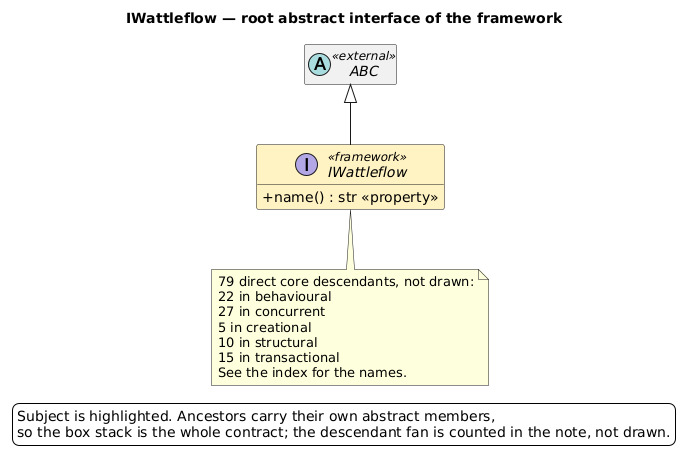

<sub>Class diagram — [source](uml/IWattleflow.puml). A view, not a source of truth (D-13).</sub>

## Creational patterns

### IBuilder

`wattleflow.core.creational.IBuilder` · `creational.py:50`

**Builder abstract interface.**

Assembles a complex object step by step; build() returns the finished
product.

Inherits: `IWattleflow, ABC`

```python
def build(self) -> Any: ...
```

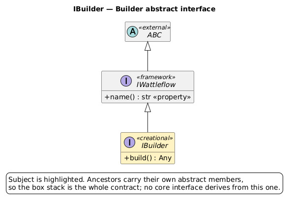

<sub>Class diagram — [source](uml/IBuilder.puml). A view, not a source of truth (D-13).</sub>

### ICreator

`wattleflow.core.creational.ICreator` · `creational.py:72`

**Factory Method (creator role) abstract interface.**

Declares factory_method, which returns a product; subclasses decide which
concrete product to instantiate.

Inherits: `IWattleflow, ABC`

```python
def factory_method(self) -> "IProduct": ...
```

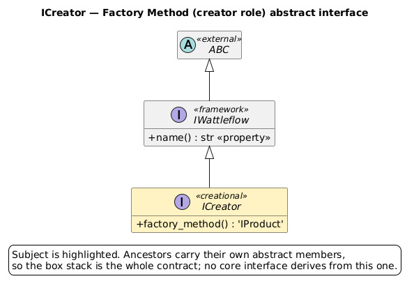

<sub>Class diagram — [source](uml/ICreator.puml). A view, not a source of truth (D-13).</sub>

### IFactory

`wattleflow.core.creational.IFactory` · `creational.py:31`

**Abstract Factory abstract interface.**

Creates objects without exposing their concrete classes. create() is a
static factory: it receives all inputs as keyword arguments and holds no
instance state (a deliberate constraint — a stateful/configurable factory
would need an instance method instead; see DR-COR-004).

Inherits: `IWattleflow, ABC`

```python
def create(**kwargs) -> Any: ...
```

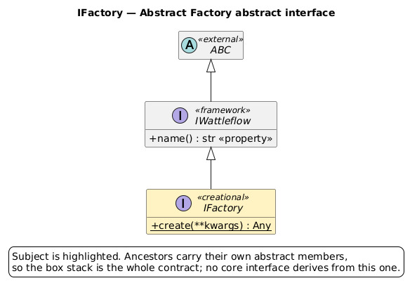

<sub>Class diagram — [source](uml/IFactory.puml). A view, not a source of truth (D-13).</sub>

### IProduct

`wattleflow.core.creational.IProduct` · `creational.py:87`

**Factory Method (product role) abstract interface.**

The object produced by an ICreator's factory_method.

Inherits: `IWattleflow, ABC`

```python
def operation(self) -> Any: ...
```

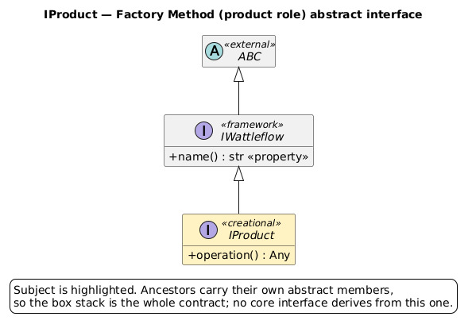

<sub>Class diagram — [source](uml/IProduct.puml). A view, not a source of truth (D-13).</sub>

### IPrototype

`wattleflow.core.creational.IPrototype` · `creational.py:102`

**Prototype abstract interface.**

Creates new objects by cloning an existing instance rather than
constructing from scratch.

Note:
    clone() is annotated "IPrototype" rather than typing.Self because the
    supported minimum is Python 3.10 (Self lands in 3.11). Reintroduce
    Self by DR when the minimum rises — stronger subclass typing at
    zero runtime cost.

Inherits: `IWattleflow, ABC`

```python
def clone(self) -> "IPrototype": ...
```

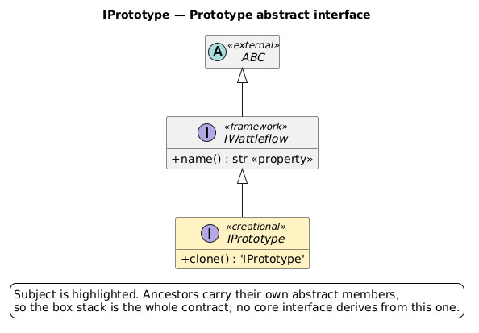

<sub>Class diagram — [source](uml/IPrototype.puml). A view, not a source of truth (D-13).</sub>

## Structural patterns

### IAbstraction

`wattleflow.core.structural.IAbstraction` · `structural.py:119`

**Bridge (abstraction role) abstract interface.**

The abstraction side of a Bridge; its operation is defined in terms of an
IImplementor.

Inherits: `IWattleflow, ABC`

```python
def operation(self) -> None: ...
```

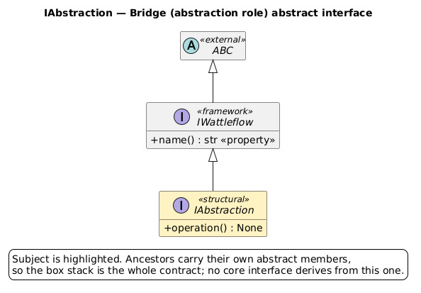

<sub>Class diagram — [source](uml/IAbstraction.puml). A view, not a source of truth (D-13).</sub>

### IAdaptee

`wattleflow.core.structural.IAdaptee` · `structural.py:40`

**Adapter (adaptee role) abstract interface.**

The object a client reaches through a wrapper. specific_request() yields
what the adaptee offers to the wrapping side; the return type is Any at
the contract level and subclasses narrow it covariantly (IDocument and
ISignal narrow to their content type; an identity adaptee may narrow to
its own type and return self). The former concrete identity default
(`return self`) was an implementation policy and now lives with concrete
identity adaptees (DR-COR-009).

Inherits: `IWattleflow, ABC`

```python
def specific_request(self) -> Any: ...
```

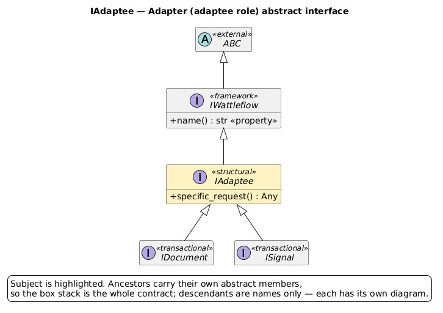

<sub>Class diagram — [source](uml/IAdaptee.puml). A view, not a source of truth (D-13).</sub>

### IAdapter

`wattleflow.core.structural.IAdapter` · `structural.py:79`

**Adapter (adapter role) abstract interface.**

Wraps an IAdaptee. Adapter and Target are deliberately separate: the
ITarget (e.g. a Facade) is what clients call; an adapter's own contract
is only that it exposes the adaptee it wraps. How the adaptee is stored
(constructor injection, lazy resolution, ...) is an implementation
decision.

Currently a catalog interface with no implementations: the document
layer delegates to the adaptee directly (see concrete/document.py).
Implement it only to wrap a FOREIGN (non-IAdaptee) object, with real
per-type translation.

Inherits: `IWattleflow, ABC`

```python
def adaptee(self) -> IAdaptee: ...
```

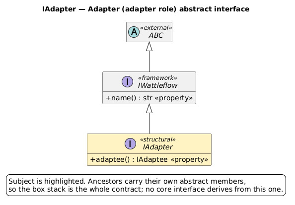

<sub>Class diagram — [source](uml/IAdapter.puml). A view, not a source of truth (D-13).</sub>

### IComponent

`wattleflow.core.structural.IComponent` · `structural.py:135`

Inherits: `IWattleflow, Generic[Element], ABC`

```python
def process(self, data: Element) -> None: ...
```

> **Finding:** no docstring.

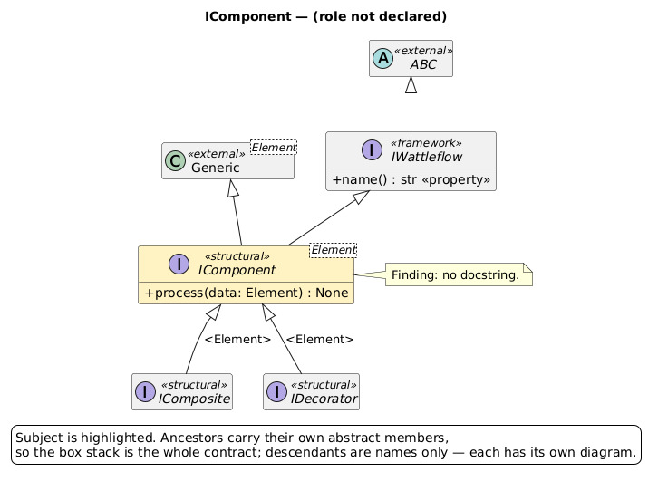

<sub>Class diagram — [source](uml/IComponent.puml). A view, not a source of truth (D-13).</sub>

### IComposite

`wattleflow.core.structural.IComposite` · `structural.py:142`

Inherits: `IComponent[Element], ABC`

```python
def add(self, component: IComponent[Element]) -> None: ...
def remove(self, component: IComponent[Element]) -> None: ...
def get_child(self, index: int) -> IComponent[Element]: ...
```

> **Finding:** no docstring.

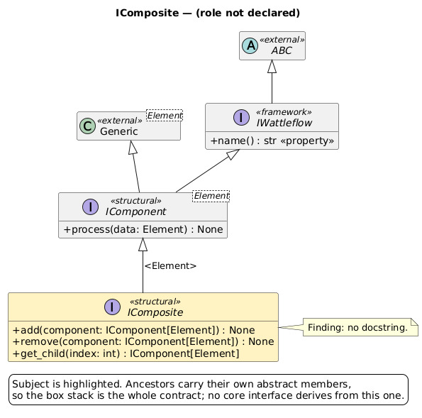

<sub>Class diagram — [source](uml/IComposite.puml). A view, not a source of truth (D-13).</sub>

### IDecorator

`wattleflow.core.structural.IDecorator` · `structural.py:153`

Inherits: `IComponent[Element], ABC`

```python
def set_component(self, component: IComponent[Element]) -> None: ...
```

> **Finding:** no docstring.

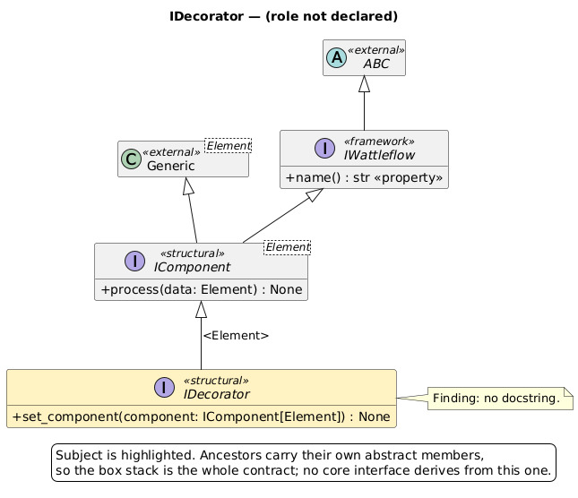

<sub>Class diagram — [source](uml/IDecorator.puml). A view, not a source of truth (D-13).</sub>

### IFacade

`wattleflow.core.structural.IFacade` · `structural.py:161`

**Facade abstract interface.**

A single simplified entry point over a more complex subsystem.

Inherits: `IWattleflow, ABC`

```python
def operation(self, action: Any) -> Any: ...
```

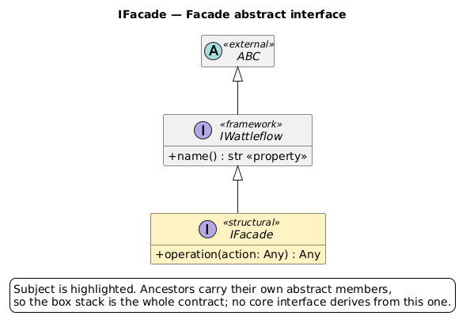

<sub>Class diagram — [source](uml/IFacade.puml). A view, not a source of truth (D-13).</sub>

### IFlyweight

`wattleflow.core.structural.IFlyweight` · `structural.py:175`

Inherits: `IWattleflow, Generic[Extrinsic], ABC`

```python
def operation(self, extrinsic_state: Extrinsic) -> None: ...
```

> **Finding:** no docstring.

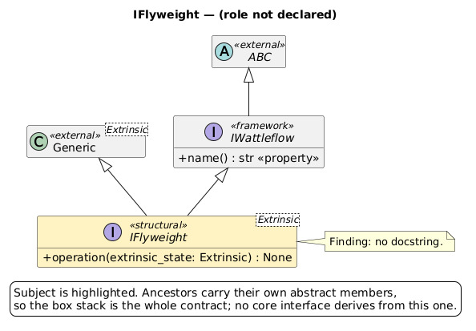

<sub>Class diagram — [source](uml/IFlyweight.puml). A view, not a source of truth (D-13).</sub>

### IFlyweightFactory

`wattleflow.core.structural.IFlyweightFactory` · `structural.py:182`

**Flyweight (factory role) abstract interface.**

Returns a shared flyweight for a key, creating it once and reusing it
thereafter. (Conventionally returns an IFlyweight; typed as Any here to
avoid binding the factory to a single flyweight type.)

Inherits: `IWattleflow, ABC`

```python
def get_flyweight(self, key: str) -> Any: ...
```

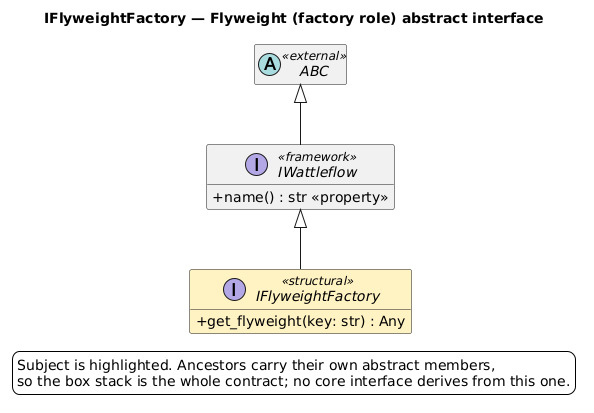

<sub>Class diagram — [source](uml/IFlyweightFactory.puml). A view, not a source of truth (D-13).</sub>

### IImplementor

`wattleflow.core.structural.IImplementor` · `structural.py:104`

**Bridge (implementor role) abstract interface.**

The implementation side of a Bridge; an IAbstraction delegates to it,
letting abstraction and implementation vary independently.

Inherits: `IWattleflow, ABC`

```python
def operation_impl(self) -> None: ...
```

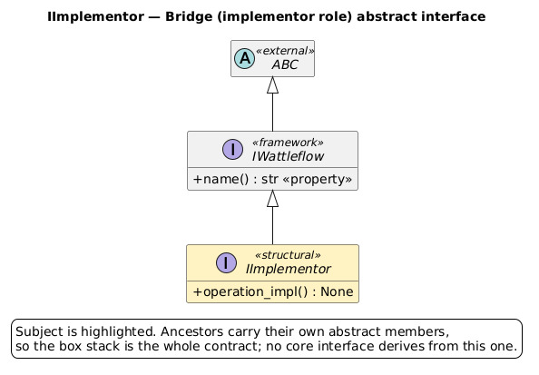

<sub>Class diagram — [source](uml/IImplementor.puml). A view, not a source of truth (D-13).</sub>

### IProxy

`wattleflow.core.structural.IProxy` · `structural.py:199`

**Proxy abstract interface.**

Stands in for another object, controlling access to it (e.g. lazy loading,
access control, remoting).

Inherits: `IWattleflow, ABC`

```python
def request(self) -> Any: ...
```

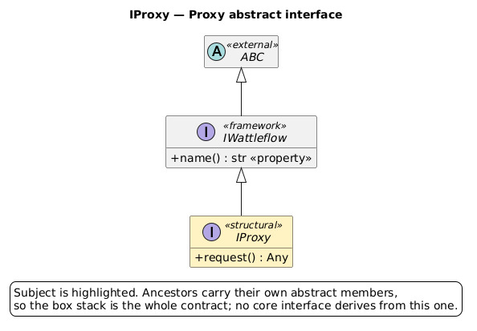

<sub>Class diagram — [source](uml/IProxy.puml). A view, not a source of truth (D-13).</sub>

### ITarget

`wattleflow.core.structural.ITarget` · `structural.py:64`

**Adapter (target role) abstract interface.**

The interface the client expects; an IAdapter implements it by delegating to
an IAdaptee.

Inherits: `IWattleflow, ABC`

```python
def request(self) -> IAdaptee: ...
```

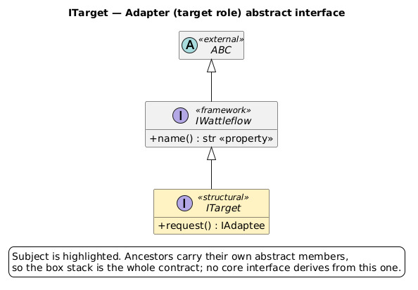

<sub>Class diagram — [source](uml/ITarget.puml). A view, not a source of truth (D-13).</sub>

## Behavioural patterns

### IAsyncAggregate

`wattleflow.core.behavioural.IAsyncAggregate` · `behavioural.py:161`

**Asynchronous Iterator (aggregate role) abstract interface.**

Inherits: `IWattleflow, Generic[Element], ABC`

```python
def create_iterator(self) -> IAsyncIterator[Element]: ...
```

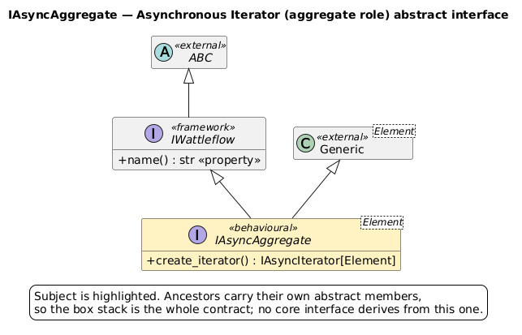

<sub>Class diagram — [source](uml/IAsyncAggregate.puml). A view, not a source of truth (D-13).</sub>

### IAsyncIterator

`wattleflow.core.behavioural.IAsyncIterator` · `behavioural.py:145`

**Asynchronous Iterator abstract interface.**

Asynchronous counterpart of IIterator; same contract shape, awaited
traversal via __anext__ (inherited abstract, from AsyncIterator).
Canonical lazy policy: wattleflow.concrete.iterator.LazyAsyncIterator.

Inherits: `IWattleflow, AsyncIterator[Element], ABC`

```python
def create_iterator(self) -> AsyncIterator[Element]: ...
```

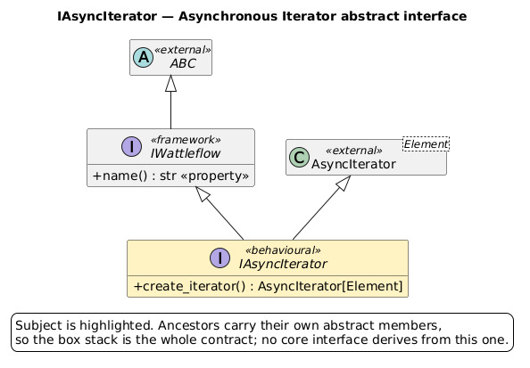

<sub>Class diagram — [source](uml/IAsyncIterator.puml). A view, not a source of truth (D-13).</sub>

### IColleague

`wattleflow.core.behavioural.IColleague` · `behavioural.py:186`

**Mediator (colleague role) abstract interface.**

Inherits: `IWattleflow, ABC`

```python
def set_mediator(self, mediator: IMediator) -> None: ...
def event_occurred(self, event: Any, **data: Any) -> None: ...
```

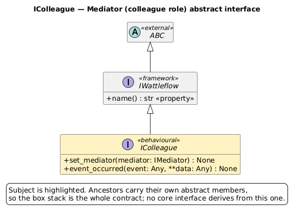

<sub>Class diagram — [source](uml/IColleague.puml). A view, not a source of truth (D-13).</sub>

### ICommand

`wattleflow.core.behavioural.ICommand` · `behavioural.py:64`

**Command abstract interface.**

Encapsulates a request as an object, decoupling the sender from the
receiver. The caller invokes execute() without knowing what work it performs.

Inherits: `IWattleflow, ABC`

```python
def execute(self, **kwargs) -> Any: ...
```

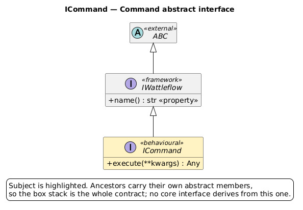

<sub>Class diagram — [source](uml/ICommand.puml). A view, not a source of truth (D-13).</sub>

### IElement

`wattleflow.core.behavioural.IElement` · `behavioural.py:406`

**Abstract interface for elements that accept visitors.**

Inherits: `IWattleflow, ABC`

```python
def accept(self, visitor: IVisitor) -> None: ...
```

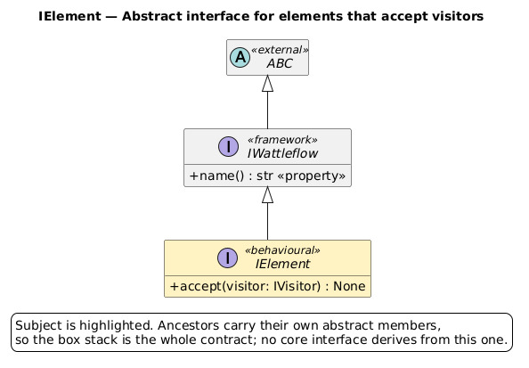

<sub>Class diagram — [source](uml/IElement.puml). A view, not a source of truth (D-13).</sub>

### IExpression

`wattleflow.core.behavioural.IExpression` · `behavioural.py:98`

**Interpreter abstract interface.**

Evaluates an expression against a context. Composite expressions are built
from simpler ones, each implementing interpret(). Parameterised over Context
and Result for input/output type safety.

Inherits: `IWattleflow, Generic[Context, Result], ABC`

```python
def interpret(self, context: Context) -> Result: ...
```

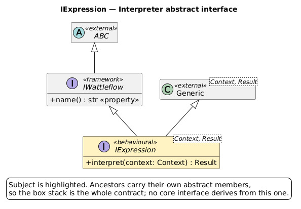

<sub>Class diagram — [source](uml/IExpression.puml). A view, not a source of truth (D-13).</sub>

### IHandler

`wattleflow.core.behavioural.IHandler` · `behavioural.py:43`

**Chain of Responsibility abstract interface.**

Each handler holds a reference to the next handler and decides whether to
process the request or pass it along. The sender does not know which handler
will ultimately handle the request.

Inherits: `IWattleflow, ABC`

```python
def set_next(self, handler: IHandler) -> None: ...
def handle(self, request: Any) -> None: ...
```

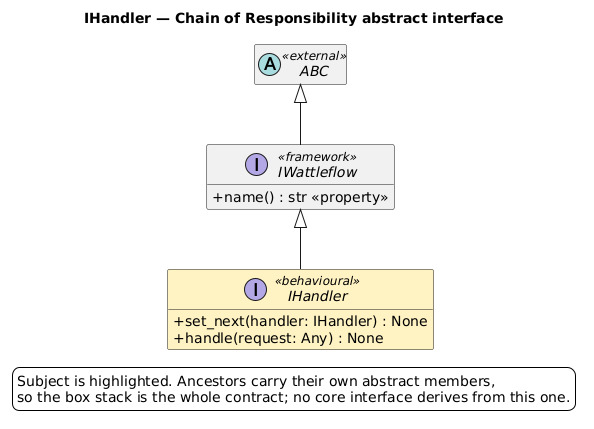

<sub>Class diagram — [source](uml/IHandler.puml). A view, not a source of truth (D-13).</sub>

### IInvoker

`wattleflow.core.behavioural.IInvoker` · `behavioural.py:79`

**Command (invoker role) abstract interface.**

Holds a command and triggers it. Sits between the client and the command,
allowing cross-cutting concerns such as logging, queuing or undo.

Inherits: `IWattleflow, ABC`

```python
def set_command(self, command: ICommand) -> None: ...
def invoke(self) -> Any: ...
```

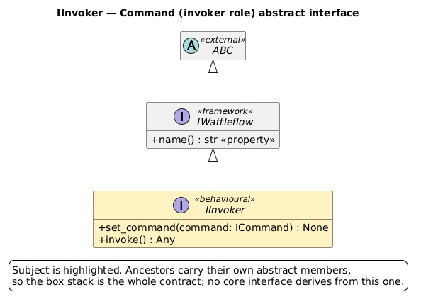

<sub>Class diagram — [source](uml/IInvoker.puml). A view, not a source of truth (D-13).</sub>

### IIterator

`wattleflow.core.behavioural.IIterator` · `behavioural.py:115`

**Iterator abstract interface.**

An iterator that knows how to build its underlying traversal via
create_iterator(). The contract fixes no construction policy: laziness
and caching are implementation decisions (see
wattleflow.concrete.iterator.LazyIterator for the canonical policy).

Inherits: `IWattleflow, Iterator[Element], ABC`

```python
def create_iterator(self) -> Iterator[Element]: ...
```

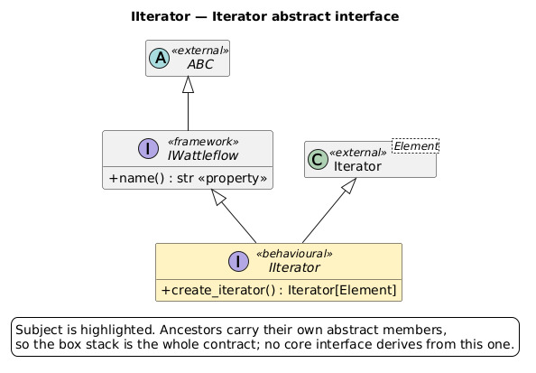

<sub>Class diagram — [source](uml/IIterator.puml). A view, not a source of truth (D-13).</sub>

### ILogger

`wattleflow.core.behavioural.ILogger` · `behavioural.py:419`

**Logger abstract interface.**

Standard severity-level logging API. Extends IObservable, so a logger may
also publish events to subscribed observers.

Inherits: `IObservable, ABC`

```python
def debug(self, msg: str, **kwargs: Any) -> None: ...
def info(self, msg: str, **kwargs: Any) -> None: ...
def warning(self, msg: str, **kwargs: Any) -> None: ...
def error(self, msg: str, **kwargs: Any) -> None: ...
def critical(self, msg: str, **kwargs: Any) -> None: ...
def exception(self, msg: str, **kwargs: Any) -> None: ...
```

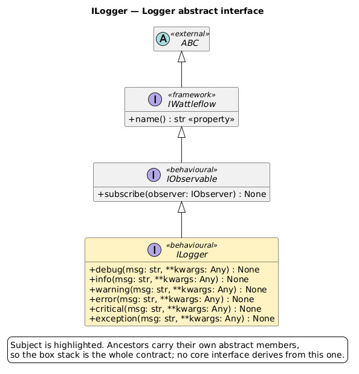

<sub>Class diagram — [source](uml/ILogger.puml). A view, not a source of truth (D-13).</sub>

### IMediator

`wattleflow.core.behavioural.IMediator` · `behavioural.py:174`

**Mediator abstract interface.**

Inherits: `IWattleflow, ABC`

```python
def notify(self, sender: IColleague, event: Any, **data: Any) -> None: ...
```

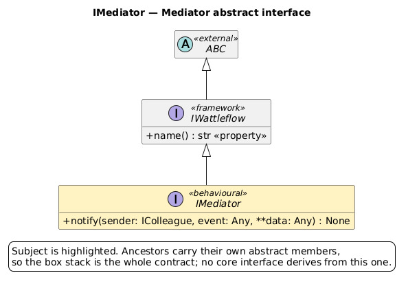

<sub>Class diagram — [source](uml/IMediator.puml). A view, not a source of truth (D-13).</sub>

### IMemento

`wattleflow.core.behavioural.IMemento` · `behavioural.py:203`

**Memento abstract interface.**

Carries a captured snapshot of an originator's internal state.

Inherits: `IWattleflow, Generic[State], ABC`

```python
def get_state(self) -> State: ...
```

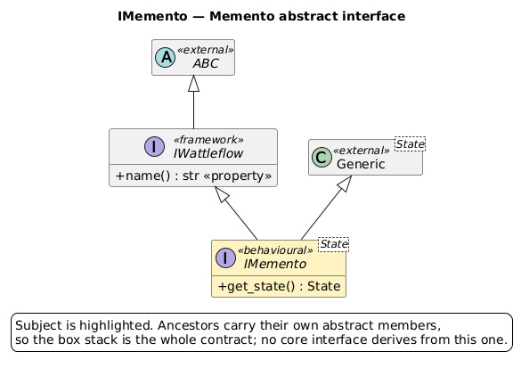

<sub>Class diagram — [source](uml/IMemento.puml). A view, not a source of truth (D-13).</sub>

### IObservable

`wattleflow.core.behavioural.IObservable` · `behavioural.py:250`

**Observer / Reactive Programming abstract interface.**

Inherits: `IWattleflow, ABC`

```python
def subscribe(self, observer: IObserver) -> None: ...
```

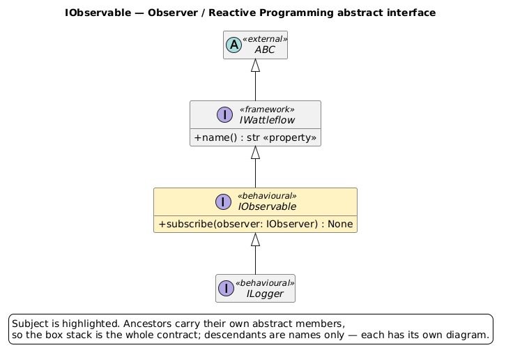

<sub>Class diagram — [source](uml/IObservable.puml). A view, not a source of truth (D-13).</sub>

### IObserver

`wattleflow.core.behavioural.IObserver` · `behavioural.py:236`

**Observer abstract interface.**

Receives notifications from an IObservable when an event occurs.

Inherits: `IWattleflow, ABC`

```python
def update(self, event: Any, **kwargs) -> None: ...
```

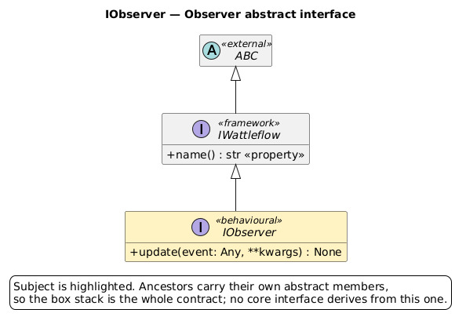

<sub>Class diagram — [source](uml/IObserver.puml). A view, not a source of truth (D-13).</sub>

### IOriginator

`wattleflow.core.behavioural.IOriginator` · `behavioural.py:217`

**Memento (originator role) abstract interface.**

Produces mementos capturing its state and restores itself from one.

Inherits: `IWattleflow, Generic[State], ABC`

```python
def save_state(self) -> IMemento[State]: ...
def restore_state(self, memento: IMemento[State]) -> None: ...
```

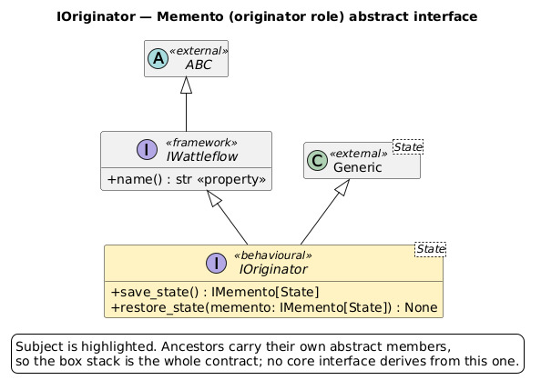

<sub>Class diagram — [source](uml/IOriginator.puml). A view, not a source of truth (D-13).</sub>

### IState

`wattleflow.core.behavioural.IState` · `behavioural.py:283`

**State abstract interface.**

Inherits: `IWattleflow, ABC`

```python
def handle(self, context: IStateContext, **kwargs: Any) -> None: ...
```

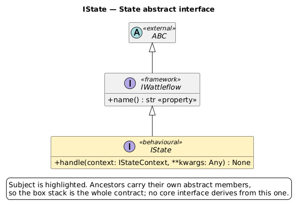

<sub>Class diagram — [source](uml/IState.puml). A view, not a source of truth (D-13).</sub>

### IStateContext

`wattleflow.core.behavioural.IStateContext` · `behavioural.py:295`

**State (context role) abstract interface.**

Inherits: `IWattleflow, ABC`

```python
def set_state(self, state: IState) -> None: ...
def request(self, **kwargs: Any) -> None: ...
```

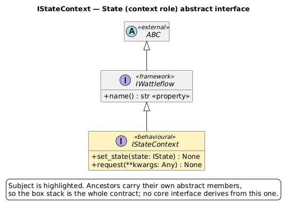

<sub>Class diagram — [source](uml/IStateContext.puml). A view, not a source of truth (D-13).</sub>

### IStateMachine

`wattleflow.core.behavioural.IStateMachine` · `behavioural.py:263`

**State Machine abstract interface.**

Guards and applies transitions: can() tests whether an action is admissible
in the current state, apply() performs it.

Inherits: `IWattleflow, ABC`

```python
def can(self, action: Action) -> bool: ...
def apply(self, action: Action) -> None: ...
```

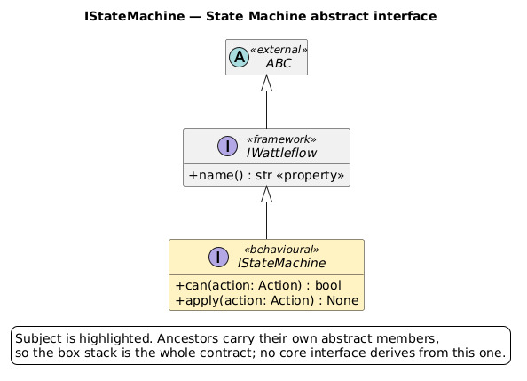

<sub>Class diagram — [source](uml/IStateMachine.puml). A view, not a source of truth (D-13).</sub>

### IStrategy

`wattleflow.core.behavioural.IStrategy` · `behavioural.py:312`

**Strategy abstract interface.**

Inherits: `IWattleflow, ABC`

```python
def execute(self, caller: IWattleflow, **kwargs) -> Any: ...
```

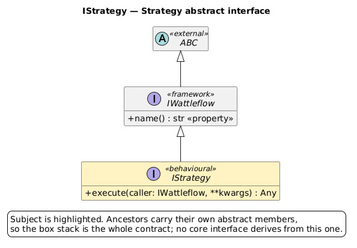

<sub>Class diagram — [source](uml/IStrategy.puml). A view, not a source of truth (D-13).</sub>

### IStrategyContext

`wattleflow.core.behavioural.IStrategyContext` · `behavioural.py:332`

**Strategy (context role) abstract interface.**

Inherits: `IWattleflow, ABC`

```python
def set_strategy(self, strategy: IStrategy) -> None: ...
def execute_strategy(self, caller: IWattleflow, **kwargs) -> Any: ...
```

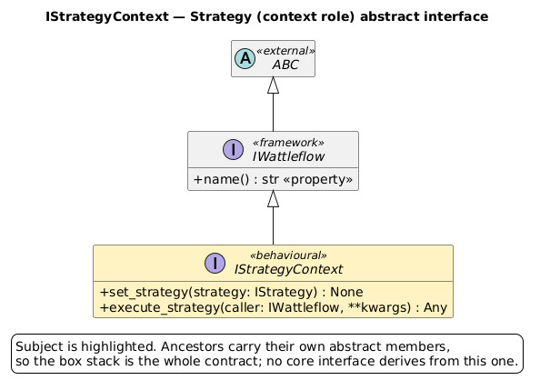

<sub>Class diagram — [source](uml/IStrategyContext.puml). A view, not a source of truth (D-13).</sub>

### ISyncAggregate

`wattleflow.core.behavioural.ISyncAggregate` · `behavioural.py:133`

**Iterator (aggregate role) abstract interface.**

Inherits: `IWattleflow, Generic[Element], ABC`

```python
def create_iterator(self) -> IIterator[Element]: ...
```

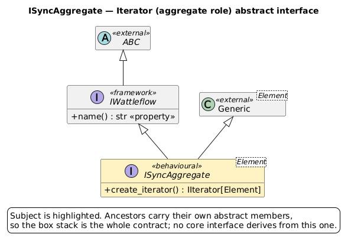

<sub>Class diagram — [source](uml/ISyncAggregate.puml). A view, not a source of truth (D-13).</sub>

### ITemplate

`wattleflow.core.behavioural.ITemplate` · `behavioural.py:349`

**The template method defining the steps of the process.**

Inherits: `IWattleflow, ABC`

```python
def initialise(self) -> None: ...
def perform_task(self) -> None: ...
def finalise(self) -> None: ...
```

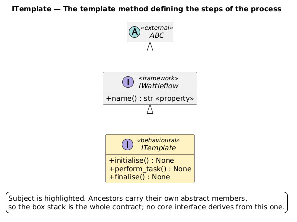

<sub>Class diagram — [source](uml/ITemplate.puml). A view, not a source of truth (D-13).</sub>

### IVisitor

`wattleflow.core.behavioural.IVisitor` · `behavioural.py:394`

**Abstract interface for Visitor pattern.**

Inherits: `IWattleflow, ABC`

```python
def visit(self, element: IElement) -> Any: ...
```

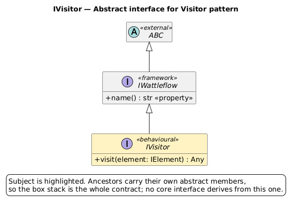

<sub>Class diagram — [source](uml/IVisitor.puml). A view, not a source of truth (D-13).</sub>

## Transactional and data patterns

### IBlackboard

`wattleflow.core.transactional.IBlackboard` · `transactional.py:263`

**Blackboard (blackboard role) abstract interface.**

Shared workspace that modules read from and write to. Holds a canvas,
registers repositories and mediates creation/lookup of target facades.

Inherits: `IWattleflow, ABC`

```python
def canvas(self) -> Dict[str, Any]: ...
def count(self) -> int: ...
def clean(self) -> None: ...
def create(self, caller: IWattleflow, *args, **kwargs) -> ITarget: ...
def read(self, identifier: str) -> ITarget: ...
def register(self, repository: IRepository) -> None: ...
def write(self, caller: IWattleflow, facade: ITarget, *args, **kwargs) -> str: ...
```

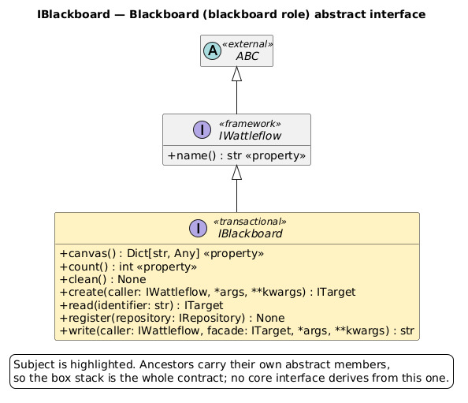

<sub>Class diagram — [source](uml/IBlackboard.puml). A view, not a source of truth (D-13).</sub>

### IConfig

`wattleflow.core.transactional.IConfig` · `transactional.py:89`

**Read-only hierarchical configuration source.**

The contract every configuration carries: resolve a path of keys to a
value, or yield the caller's default when the path is absent. It fixes no
serialisation format, no file, and no resolution policy — a document on
disk, an in-memory mapping and a secret-resolving adapter all satisfy it,
which is what lets a consumer state its need without naming a format.

Absence is answered with `default`, never by raising: configuration
lookups sit on the construction path, where an exception per missing
optional key would make every consumer defensive.

Inherits: `IWattleflow, ABC`

```python
def find(self, *keys: str, default: Any = None) -> Any: ...
```

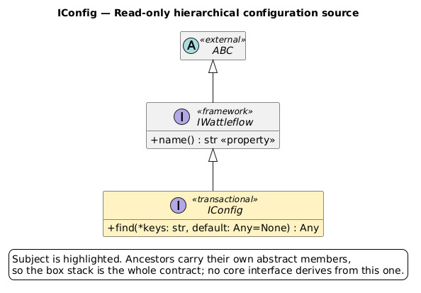

<sub>Class diagram — [source](uml/IConfig.puml). A view, not a source of truth (D-13).</sub>

### IDocument

`wattleflow.core.transactional.IDocument` · `transactional.py:46`

Inherits: `IAdaptee, Generic[Content], ABC`

```python
def update_content(self, content: Content) -> None: ...
def specific_request(self) -> Content: ...
```

> **Finding:** no docstring.

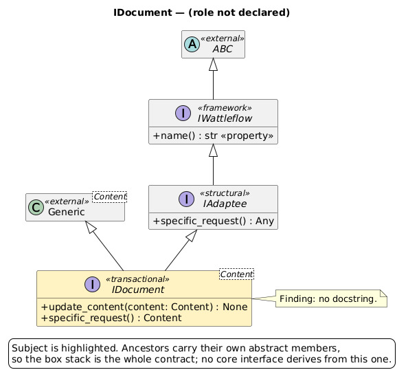

<sub>Class diagram — [source](uml/IDocument.puml). A view, not a source of truth (D-13).</sub>

### IDriver

`wattleflow.core.transactional.IDriver` · `transactional.py:56`

**Resource driver abstract interface.**

Manages the lifecycle of an external resource (open/close) and reads from or
writes to it by URI. metadata() describes the driver at the class level.

Inherits: `IWattleflow, ABC`

```python
def load(self) -> None: ...
def close(self) -> None: ...
def read(self, uri: str, **kwargs) -> Any: ...
def write(self, uri: str, **kwargs) -> Any: ...
def metadata(cls) -> Any: ...
```

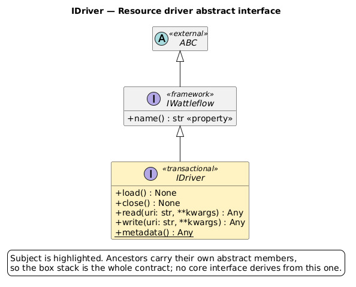

<sub>Class diagram — [source](uml/IDriver.puml). A view, not a source of truth (D-13).</sub>

### IEvent

`wattleflow.core.transactional.IEvent` · `transactional.py:158`

**Event-Driven (event) abstract interface.**

An immutable description of something that happened: identity, optional
correlation/source, timestamp, type and payload.

Inherits: `IWattleflow, ABC`

```python
def correlation_id(self) -> Optional[str]: ...
def id(self) -> str: ...
def source(self) -> Optional[str]: ...
def timestamp(self) -> datetime: ...
def type(self) -> str: ...
def payload(self) -> Dict[str, Any]: ...
```

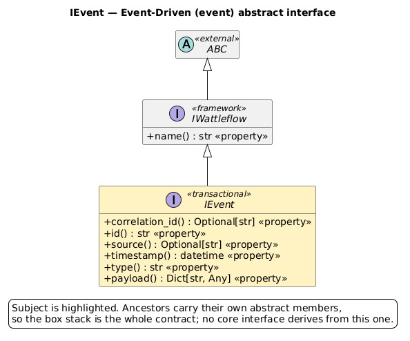

<sub>Class diagram — [source](uml/IEvent.puml). A view, not a source of truth (D-13).</sub>

### IEventListener

`wattleflow.core.transactional.IEventListener` · `transactional.py:199`

**Event-Driven (listener role) abstract interface.**

Reacts to events delivered by an IEventSource.

Inherits: `IWattleflow, ABC`

```python
def on_event(self, event: IEvent) -> None: ...
```

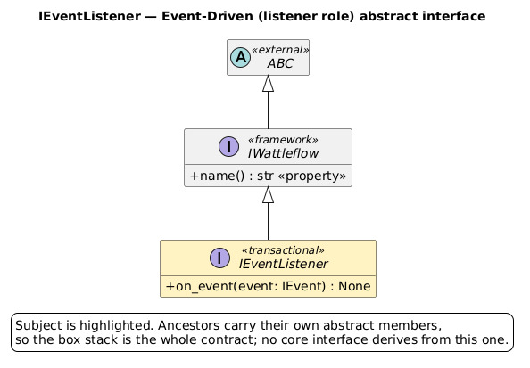

<sub>Class diagram — [source](uml/IEventListener.puml). A view, not a source of truth (D-13).</sub>

### IEventSource

`wattleflow.core.transactional.IEventSource` · `transactional.py:213`

**Event-Driven (source role) abstract interface.**

Registers listeners and emits events to them. Generic over the emitted
Event type; **kwargs carries emission metadata (DR-COR-010) so subclasses
need no widening override.

Inherits: `IWattleflow, Generic[Event], ABC`

```python
def register_listener(self, listener: IEventListener) -> None: ...
def emit_event(self, event: Event, **kwargs) -> None: ...
```

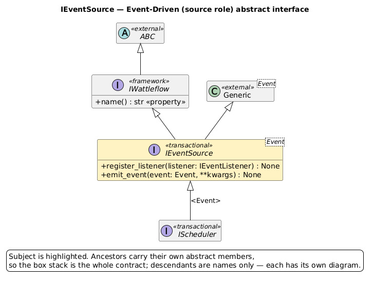

<sub>Class diagram — [source](uml/IEventSource.puml). A view, not a source of truth (D-13).</sub>

### IFormatter

`wattleflow.core.transactional.IFormatter` · `transactional.py:133`

**Serialisation abstract interface.**

The write-side mirror of IParser: renders a domain object into a payload.
The caller owns the sink, so render() returns the payload and writes
nothing. As with IParser, the contract fixes no transport.

Inherits: `IWattleflow, Generic[Content], ABC`

```python
def render(self, **kwargs) -> bytes | str: ...
```

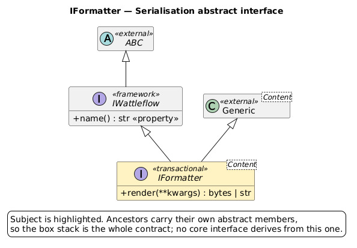

<sub>Class diagram — [source](uml/IFormatter.puml). A view, not a source of truth (D-13).</sub>

### IModule

`wattleflow.core.transactional.IModule` · `transactional.py:310`

**Blackboard (knowledge-source role) abstract interface.**

A knowledge source that inspects and updates the blackboard.

Inherits: `IWattleflow, ABC`

```python
def update(self, blackboard: IBlackboard, *args, **kwargs) -> None: ...
```

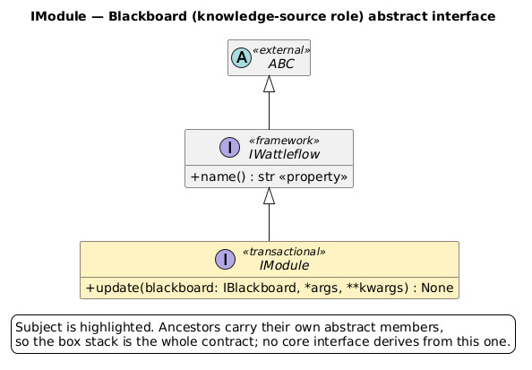

<sub>Class diagram — [source](uml/IModule.puml). A view, not a source of truth (D-13).</sub>

### IParser

`wattleflow.core.transactional.IParser` · `transactional.py:114`

**Deserialisation abstract interface.**

A Strategy specialisation at the I/O boundary: turns a serialised source
into a domain object. The contract fixes no transport — what a source is
(open stream, path, in-memory payload) and how it is obtained is the
implementation's policy, not the interface's. Not an Interpreter: the
catalogue excludes parsing from that pattern, and no grammar or composite
expression tree is implied here.

Inherits: `IWattleflow, Generic[Content], ABC`

```python
def parse(self, **kwargs) -> Content: ...
```

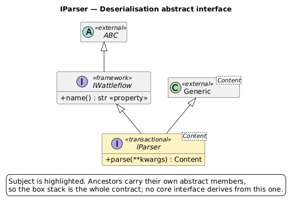

<sub>Class diagram — [source](uml/IParser.puml). A view, not a source of truth (D-13).</sub>

### IPipeline

`wattleflow.core.transactional.IPipeline` · `transactional.py:325`

**Pipeline abstract interface.**

Drives a target facade through a processor as one stage of processing.

Inherits: `IWattleflow, ABC`

```python
def process(self, processor: "IProcessor", facade: ITarget, *args, **kwargs) -> None: ...
```

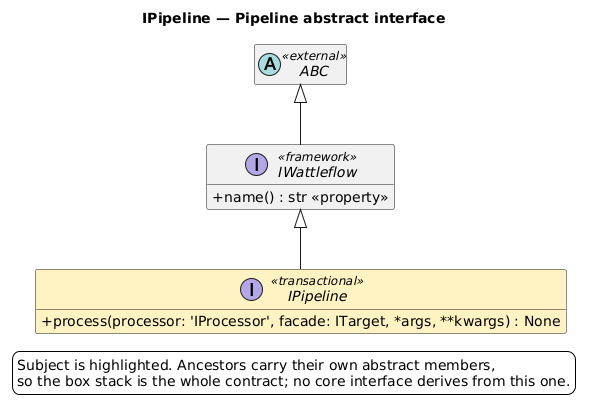

<sub>Class diagram — [source](uml/IPipeline.puml). A view, not a source of truth (D-13).</sub>

### IProcessor

`wattleflow.core.transactional.IProcessor` · `transactional.py:346`

**Processor abstract interface.**

Produces a generator of work items and starts processing them.

Inherits: `IWattleflow, Generic[Item], ABC`

```python
def create_generator(self) -> Item: ...
def start(self) -> None: ...
```

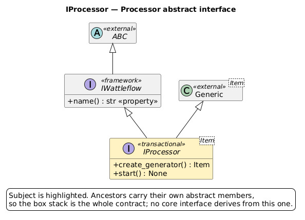

<sub>Class diagram — [source](uml/IProcessor.puml). A view, not a source of truth (D-13).</sub>

### IQuery

`wattleflow.core.transactional.IQuery` · `transactional.py:370`

**Query Object abstract interface.**

Encapsulates a query that yields a typed result when executed.

Inherits: `IWattleflow, Generic[Result], ABC`

```python
def execute(self) -> Result: ...
```

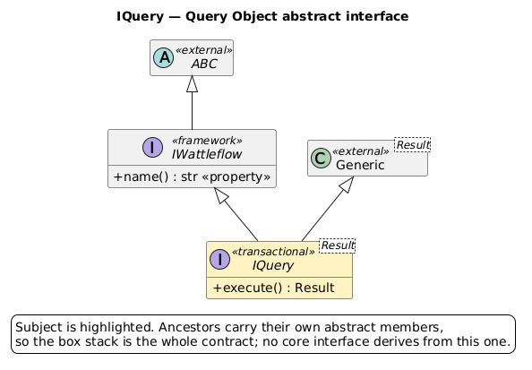

<sub>Class diagram — [source](uml/IQuery.puml). A view, not a source of truth (D-13).</sub>

### IRepository

`wattleflow.core.transactional.IRepository` · `transactional.py:234`

**Repository abstract interface.**

Collection-like persistence boundary: counts, clears, reads by identifier
and writes target facades.

Inherits: `IWattleflow, ABC`

```python
def count(self) -> int: ...
def clear(self) -> None: ...
def read(self, identifier: str, *args, **kwargs) -> ITarget: ...
def write(self, facade: ITarget, *args, **kwargs) -> bool: ...
```

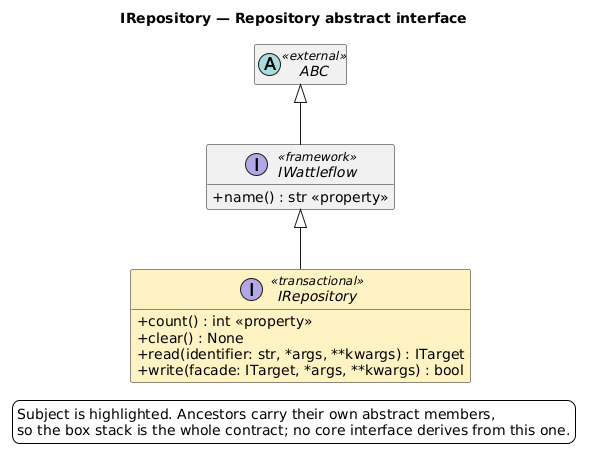

<sub>Class diagram — [source](uml/IRepository.puml). A view, not a source of truth (D-13).</sub>

### ISaga

`wattleflow.core.transactional.ISaga` · `transactional.py:385`

**Saga abstract interface.**

Coordinates a long-running transaction as a sequence of steps, compensating
completed steps if a later one fails.

Inherits: `IWattleflow, Generic[Event], ABC`

```python
def start(self, initial_state, *args, **kwargs) -> None: ...
def handle_event(self, event: Event, *args, **kwargs) -> None: ...
def compensate(self) -> None: ...
```

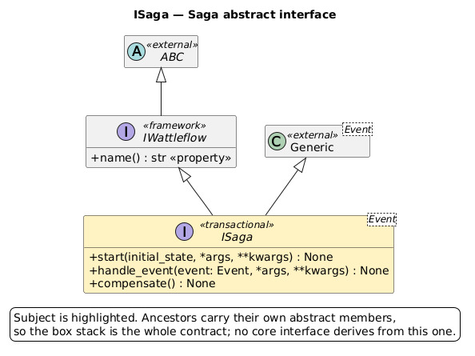

<sub>Class diagram — [source](uml/ISaga.puml). A view, not a source of truth (D-13).</sub>

### IScheduler

`wattleflow.core.transactional.IScheduler` · `transactional.py:443`

**Scheduler / Orchestrator abstract interface (Event-Driven source).**

Orchestrates execution of work and emits lifecycle events. A pure
contract: the single-instance policy, if required, belongs on the
concrete implementation (e.g. `class Scheduler(Wattleflow, IScheduler[Event],
Singleton)`), not here.

Inherits: `IEventSource[Event], ABC`

```python
def setup_orchestrator(self, *args, **kwargs) -> None: ...
def start_orchestration(self, parallel: bool) -> None: ...
def stop_orchestration(self) -> None: ...
```

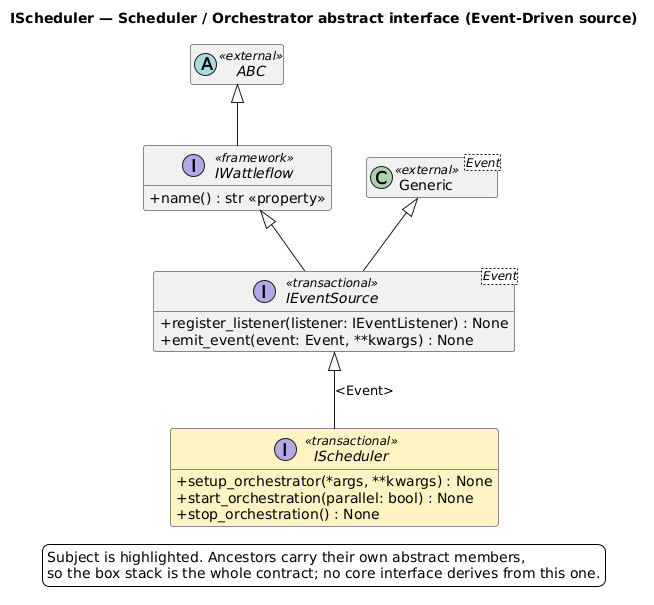

<sub>Class diagram — [source](uml/IScheduler.puml). A view, not a source of truth (D-13).</sub>

### ISignal

`wattleflow.core.transactional.ISignal` · `transactional.py:150`

Inherits: `IAdaptee, Generic[Content], ABC`

```python
def specific_request(self) -> Content: ...
```

> **Finding:** no docstring.

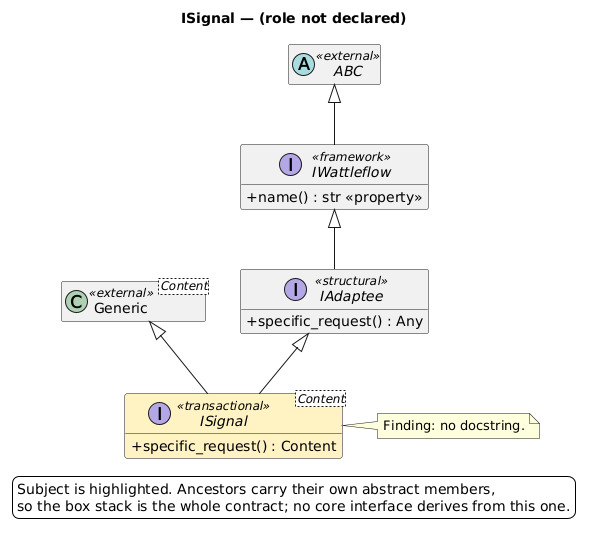

<sub>Class diagram — [source](uml/ISignal.puml). A view, not a source of truth (D-13).</sub>

### IUnitOfWork

`wattleflow.core.transactional.IUnitOfWork` · `transactional.py:409`

**Unit of Work abstract interface.**

Tracks new/dirty/deleted entities within a business transaction and applies
them atomically on commit (or discards them on rollback).

Inherits: `IWattleflow, Generic[Entity], ABC`

```python
def commit(self) -> None: ...
def rollback(self) -> None: ...
def register_new(self, entity: Entity, *args, **kwargs) -> None: ...
def register_dirty(self, entity: Entity, *args, **kwargs) -> None: ...
def register_deleted(self, entity: Entity, *args, **kwargs) -> None: ...
```

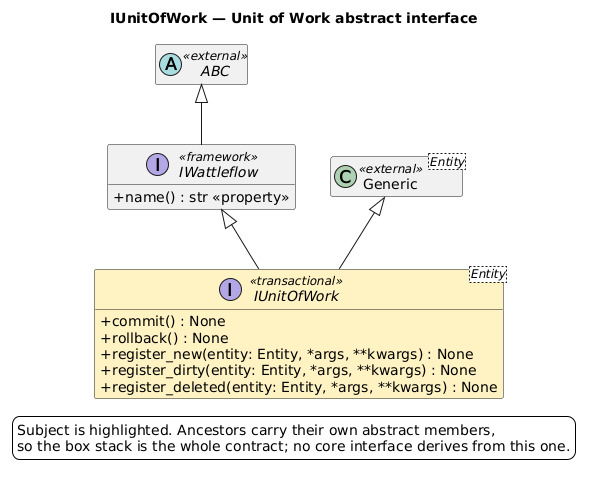

<sub>Class diagram — [source](uml/IUnitOfWork.puml). A view, not a source of truth (D-13).</sub>

## Concurrent and reactive patterns

### IActor

`wattleflow.core.concurrent.IActor` · `concurrent.py:46`

**Actor Model abstract interface.**

An actor processes messages sequentially, one at a time, holding its own
private state. Concurrency arises from many actors running independently.

Inherits: `IWattleflow, Generic[Message], ABC`

```python
def receive(self, message: Message) -> None: ...
```

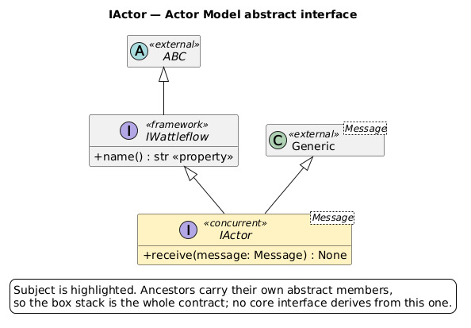

<sub>Class diagram — [source](uml/IActor.puml). A view, not a source of truth (D-13).</sub>

### IBSPSystem

`wattleflow.core.concurrent.IBSPSystem` · `concurrent.py:369`

**Bulk Synchronous Parallel (system role) abstract interface.**

Runs an ordered sequence of supersteps, synchronising between each.

Inherits: `IWattleflow, ABC`

```python
def run_supersteps(self, supersteps: Iterable[ISuperstep], data: Any) -> None: ...
```

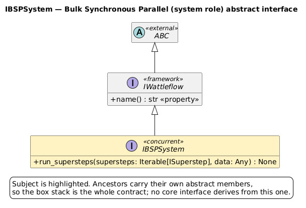

<sub>Class diagram — [source](uml/IBSPSystem.puml). A view, not a source of truth (D-13).</sub>

### IBarrier

`wattleflow.core.concurrent.IBarrier` · `concurrent.py:418`

**Barrier synchronisation abstract interface.**

Blocks each participating thread until all participants have reached the
barrier, then releases them together.

Inherits: `IWattleflow, ABC`

```python
def wait(self) -> None: ...
```

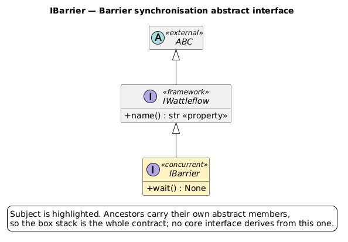

<sub>Class diagram — [source](uml/IBarrier.puml). A view, not a source of truth (D-13).</sub>

### ICallback

`wattleflow.core.concurrent.ICallback` · `concurrent.py:112`

**Callback abstract interface.**

A deferred unit of work invoked with arbitrary arguments, returning a value.

Inherits: `IWattleflow, Generic[Result], ABC`

```python
def call(self, *args, **kwargs) -> Result: ...
```


<sub>Class diagram — [source](uml/ICallback.puml). A view, not a source of truth (D-13).</sub>

### ICoroutine

`wattleflow.core.concurrent.ICoroutine` · `concurrent.py:294`

**Coroutine abstract interface (generator-like).**

Type parameters  [NFRQ-ORG-03]
---------------
Output — type produced (yielded) by the coroutine on each step
Input  — type accepted by send()

Note:
    The completion value (a generator's StopIteration.value) is not exposed
    as a method return here, so no Result parameter is declared. Re-add a
    Result type parameter only if a method is added to surface it.

Inherits: `IWattleflow, Generic[Output, Input], ABC`

```python
def send(self, value: Input) -> Output: ...
def throw(self, typ: type[BaseException], val: BaseException | None = None, tb: Any = None) -> Output: ...
def close(self) -> None: ...
```

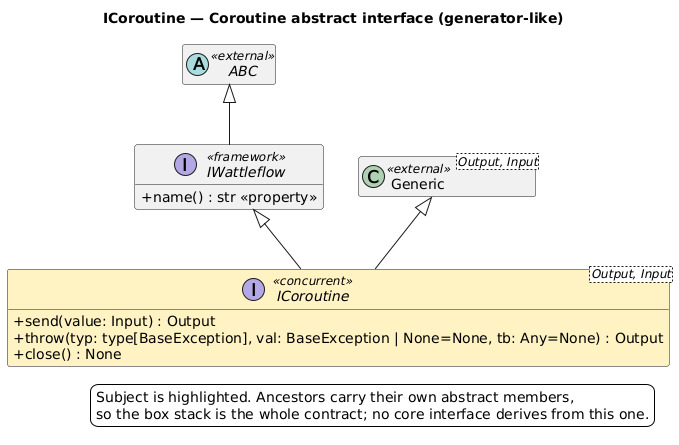

<sub>Class diagram — [source](uml/ICoroutine.puml). A view, not a source of truth (D-13).</sub>

### IDataParallelTask

`wattleflow.core.concurrent.IDataParallelTask` · `concurrent.py:458`

**Data Parallelism abstract interface.**

Applies the same operation to an independent chunk of data; many chunks run
in parallel.

Inherits: `IWattleflow, ABC`

```python
def execute(self, data_chunk: Any) -> None: ...
```

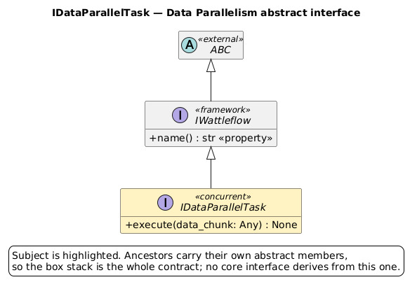

<sub>Class diagram — [source](uml/IDataParallelTask.puml). A view, not a source of truth (D-13).</sub>

### IDivideAndConquer

`wattleflow.core.concurrent.IDivideAndConquer` · `concurrent.py:434`

**Divide and Conquer abstract interface.**

Splits a problem into sub-problems, solves each, and combines the partial
solutions into the final result.

Inherits: `IWattleflow, ABC`

```python
def divide(self, problem: Any) -> Iterable[Any]: ...
def solve_subproblem(self, subproblem: Any) -> Any: ...
def combine(self, solutions: Any) -> Any: ...
```

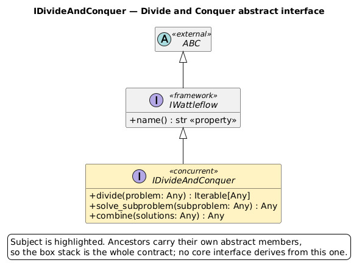

<sub>Class diagram — [source](uml/IDivideAndConquer.puml). A view, not a source of truth (D-13).</sub>

### IEventLoop

`wattleflow.core.concurrent.IEventLoop` · `concurrent.py:170`

**Event Loop abstract interface (synchronous).**

Drives a single-threaded loop that runs scheduled callbacks until stopped.

Inherits: `IWattleflow, ABC`

```python
def run_forever(self) -> None: ...
def stop(self) -> None: ...
def call_soon(self, callback: Callable[..., None], *args) -> None: ...
```

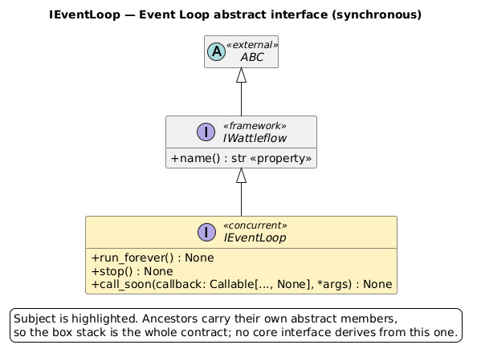

<sub>Class diagram — [source](uml/IEventLoop.puml). A view, not a source of truth (D-13).</sub>

### IForkJoinPool

`wattleflow.core.concurrent.IForkJoinPool` · `concurrent.py:403`

**Fork/Join (pool role) abstract interface.**

Executes a fork/join task to completion and returns its result.

Inherits: `IWattleflow, ABC`

```python
def invoke(self, task: Any) -> Any: ...
```

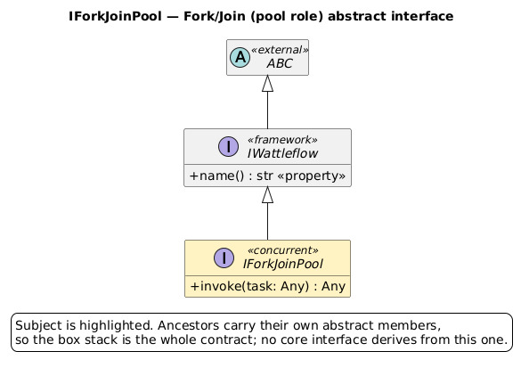

<sub>Class diagram — [source](uml/IForkJoinPool.puml). A view, not a source of truth (D-13).</sub>

### IForkJoinTask

`wattleflow.core.concurrent.IForkJoinTask` · `concurrent.py:384`

**Fork/Join (task role) abstract interface.**

Splits itself into subtasks (fork) and waits for their completion, returning
the combined result (join).

Inherits: `IWattleflow, ABC`

```python
def fork(self) -> None: ...
def join(self) -> Any: ...
```

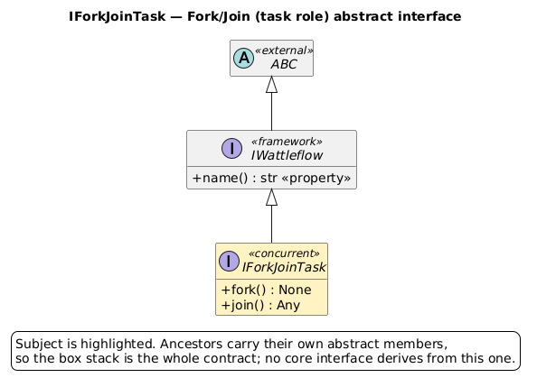

<sub>Class diagram — [source](uml/IForkJoinTask.puml). A view, not a source of truth (D-13).</sub>

### IFuture

`wattleflow.core.concurrent.IFuture` · `concurrent.py:81`

**Future abstract interface.**

Read side of an asynchronous result: blocking retrieval of a value that may
not yet be available, with an optional timeout.

Inherits: `IWattleflow, Generic[Result], ABC`

```python
def result(self, timeout: Optional[float] = None) -> Result: ...
```

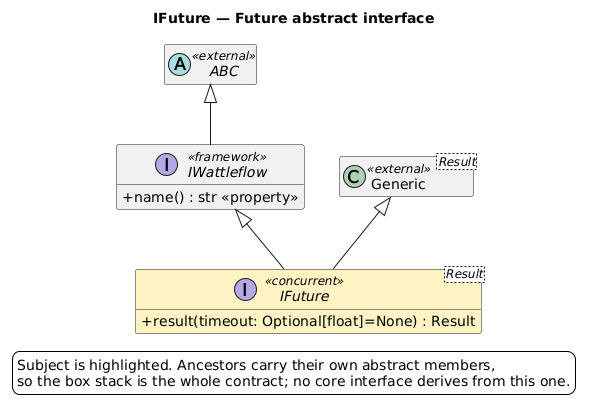

<sub>Class diagram — [source](uml/IFuture.puml). A view, not a source of truth (D-13).</sub>

### IGraphProcessing

`wattleflow.core.concurrent.IGraphProcessing` · `concurrent.py:521`

**Graph Processing (vertex-centric) abstract interface.**

Defines per-vertex and per-edge computation for parallel graph traversal.
Parameterised separately over Vertex and Edge types.

Inherits: `IWattleflow, Generic[Vertex, Edge], ABC`

```python
def process_vertex(self, vertex: Vertex) -> None: ...
def process_edge(self, edge: Edge) -> None: ...
```

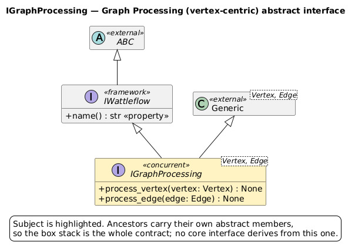

<sub>Class diagram — [source](uml/IGraphProcessing.puml). A view, not a source of truth (D-13).</sub>

### IMapper

`wattleflow.core.concurrent.IMapper` · `concurrent.py:325`

**MapReduce (mapper role) abstract interface.**

Transforms input data into intermediate (key, value) pairs for grouping.

Inherits: `IWattleflow, Generic[Key, Value], ABC`

```python
def map(self, data: Iterable[Value]) -> Iterable[Tuple[Key, Value]]: ...
```

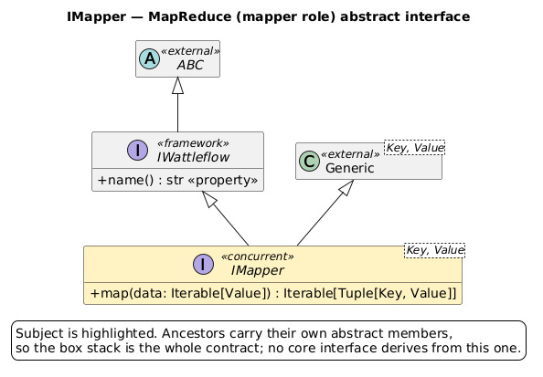

<sub>Class diagram — [source](uml/IMapper.puml). A view, not a source of truth (D-13).</sub>

### IMessageQueue

`wattleflow.core.concurrent.IMessageQueue` · `concurrent.py:231`

**Message Queue abstract interface (generic bidirectional transport).**

Type parameters
---------------
Message     — payload type (bytes, dict, str, custom object, ...)
Destination — destination/source routing type (str topic, URL, queue name,
              typed address object, ...)

Examples
--------
IMessageQueue[bytes, str]          → Kafka  (bytes message, str topic)
IMessageQueue[dict,  str]          → JSON queue (dict, str queue name)
IMessageQueue[bytes, str]          → HTTP   (bytes body, str URL)
IMessageQueue[bytes, QueueAddress] → AMQP with a typed address

Notes
-----
acknowledge() has a concrete no-op default — override only in systems
that require explicit commit/ack (e.g. Kafka, AMQP manual-ack mode).
Declared as an accepted contract default (Null-ack semantics): "ack is
optional" is part of the contract, not an implementation policy
(DR-COR-012).

Inherits: `IWattleflow, Generic[Message, Destination], ABC`

```python
def send(self, message: Message, destination: Destination) -> None: ...
def receive(self, source: Destination, timeout: Optional[float] = None) -> Optional[Message]: ...
```

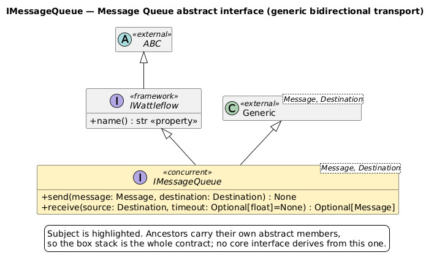

<sub>Class diagram — [source](uml/IMessageQueue.puml). A view, not a source of truth (D-13).</sub>

### IObservableReactive

`wattleflow.core.concurrent.IObservableReactive` · `concurrent.py:142`

**Observable (reactive) abstract interface.**

Registers and unregisters observers and notifies them of events. The
contract deliberately fixes no delivery policy: thread-safety, delivery
order, and observer-failure handling are implementation decisions (see
wattleflow.concrete.observable.ThreadSafeObservable for the canonical
policy: lock-guarded registration, snapshot delivery in registration
order, observer exceptions logged and suppressed).

Inherits: `IWattleflow, ABC`

```python
def add_observer(self, observer: IObserverReactive) -> None: ...
def remove_observer(self, observer: IObserverReactive) -> None: ...
def notify_observers(self, *args, **kwargs) -> None: ...
```

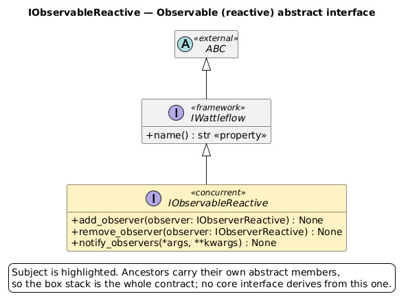

<sub>Class diagram — [source](uml/IObservableReactive.puml). A view, not a source of truth (D-13).</sub>

### IObserverReactive

`wattleflow.core.concurrent.IObserverReactive` · `concurrent.py:127`

**Observer (reactive) abstract interface.**

Receives push notifications from an IObservableReactive, with a reference to
the source observable.

Inherits: `IWattleflow, ABC`

```python
def update(self, observable: "IObservableReactive", *args, **kwargs) -> None: ...
```

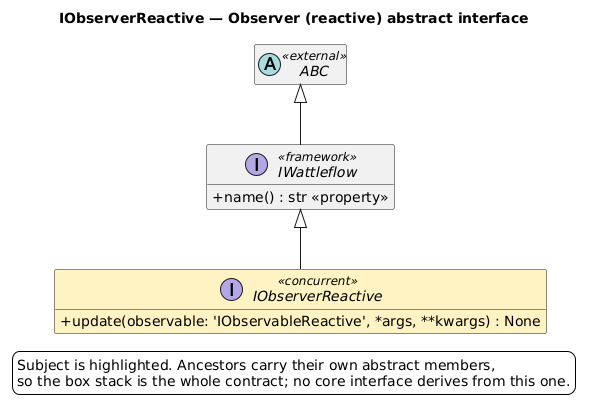

<sub>Class diagram — [source](uml/IObserverReactive.puml). A view, not a source of truth (D-13).</sub>

### IPromise

`wattleflow.core.concurrent.IPromise` · `concurrent.py:96`

**Promise abstract interface.**

Write side of an asynchronous result: fulfils the value that a corresponding
future will return.

Inherits: `IWattleflow, Generic[Result], ABC`

```python
def set_result(self, result: Result) -> None: ...
```

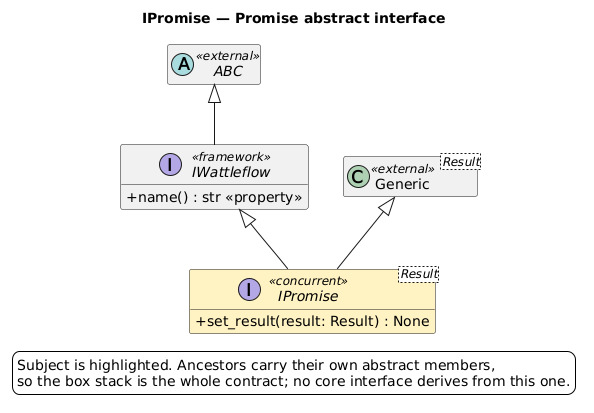

<sub>Class diagram — [source](uml/IPromise.puml). A view, not a source of truth (D-13).</sub>

### IPublisher

`wattleflow.core.concurrent.IPublisher` · `concurrent.py:193`

**Publish-Subscribe (publisher role) abstract interface.**

Maintains subscribers and broadcasts messages to them. Publisher and
subscribers are decoupled: the publisher does not know who consumes.

Inherits: `IWattleflow, Generic[Message], ABC`

```python
def subscribe(self, subscriber: "ISubscriber[Message]") -> None: ...
def unsubscribe(self, subscriber: "ISubscriber[Message]") -> None: ...
def notify(self, message: Message) -> None: ...
```

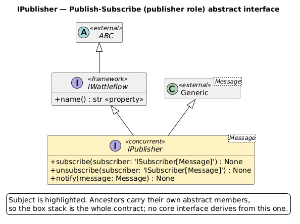

<sub>Class diagram — [source](uml/IPublisher.puml). A view, not a source of truth (D-13).</sub>

### IReducer

`wattleflow.core.concurrent.IReducer` · `concurrent.py:339`

**MapReduce (reducer role) abstract interface.**

Reduces all values grouped under a key into a single (key, value) result.

Inherits: `IWattleflow, Generic[Key, Value], ABC`

```python
def reduce(self, key: Key, values: Iterable[Value]) -> Tuple[Key, Value]: ...
```

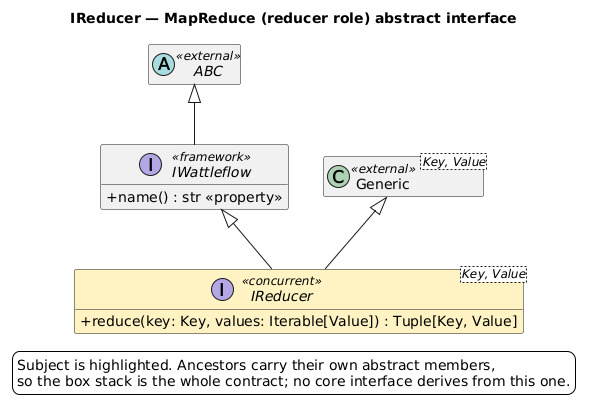

<sub>Class diagram — [source](uml/IReducer.puml). A view, not a source of truth (D-13).</sub>

### ISPMDProgram

`wattleflow.core.concurrent.ISPMDProgram` · `concurrent.py:541`

**SPMD (Single Program, Multiple Data) abstract interface.**

The same program runs on every process, each operating on its own data
partition.

Inherits: `IWattleflow, ABC`

```python
def execute(self, data_partition: Any) -> None: ...
```

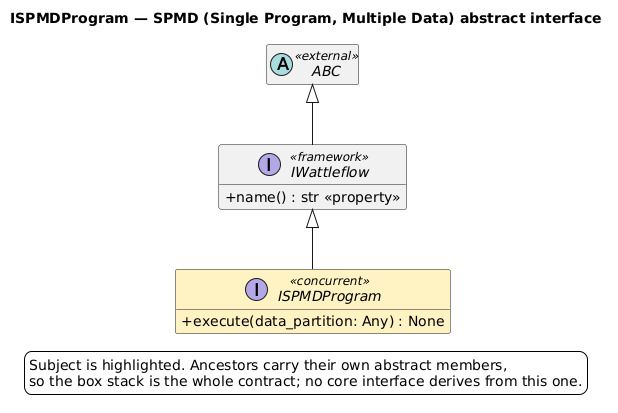

<sub>Class diagram — [source](uml/ISPMDProgram.puml). A view, not a source of truth (D-13).</sub>

### IStencil

`wattleflow.core.concurrent.IStencil` · `concurrent.py:506`

**Stencil computation abstract interface.**

Computes a new value at a grid point from the values of its neighbourhood.

Inherits: `IWattleflow, ABC`

```python
def apply(self, grid: Any, point: Any) -> Any: ...
```

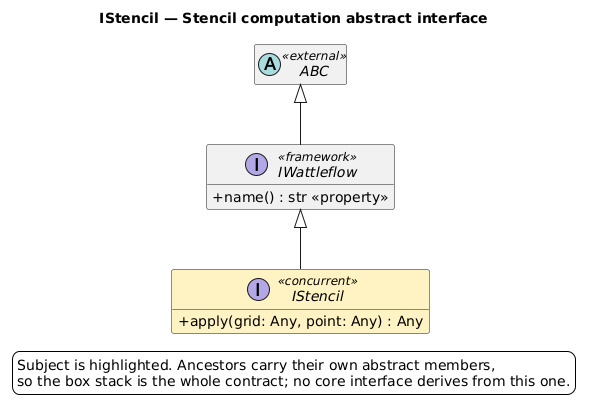

<sub>Class diagram — [source](uml/IStencil.puml). A view, not a source of truth (D-13).</sub>

### ISubscriber

`wattleflow.core.concurrent.ISubscriber` · `concurrent.py:216`

**Publish-Subscribe (subscriber role) abstract interface.**

Receives messages broadcast by an IPublisher.

Inherits: `IWattleflow, Generic[Message], ABC`

```python
def update(self, message: Message) -> None: ...
```

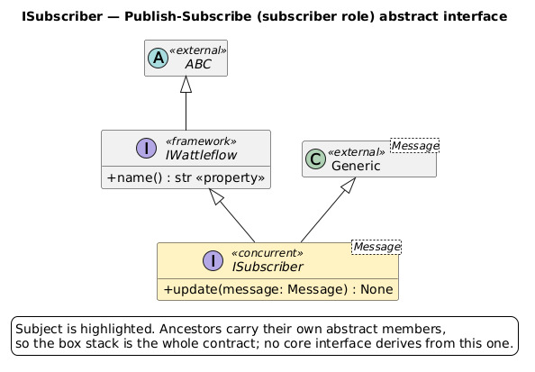

<sub>Class diagram — [source](uml/ISubscriber.puml). A view, not a source of truth (D-13).</sub>

### ISuperstep

`wattleflow.core.concurrent.ISuperstep` · `concurrent.py:354`

**Bulk Synchronous Parallel (superstep) abstract interface.**

A single BSP step: local computation over the data before the next global
synchronisation barrier.

Inherits: `IWattleflow, ABC`

```python
def execute(self, data: Any) -> Any: ...
```

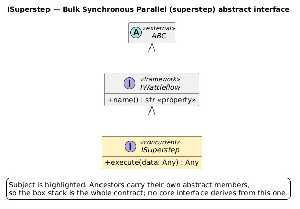

<sub>Class diagram — [source](uml/ISuperstep.puml). A view, not a source of truth (D-13).</sub>

### ISystem

`wattleflow.core.concurrent.ISystem` · `concurrent.py:61`

**Actor Model (system role) abstract interface.**

Creates actors and routes messages to them. Owns the lifecycle and
scheduling of the actors it spawns.

Inherits: `IWattleflow, ABC`

```python
def create_actor(self, actor_class: type[IActor[Message]], *args, **kwargs) -> IActor[Message]: ...
def send_message(self, actor: IActor[Message], message: Message, *args, **kwargs) -> None: ...
```

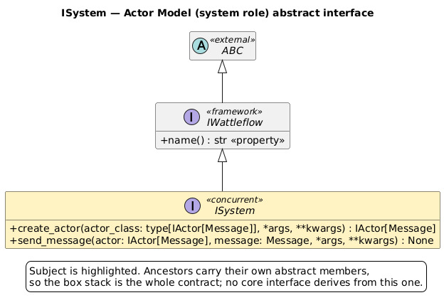

<sub>Class diagram — [source](uml/ISystem.puml). A view, not a source of truth (D-13).</sub>

### IThreadPool

`wattleflow.core.concurrent.IThreadPool` · `concurrent.py:274`

**Thread Pool abstract interface.**

Submits callables for execution on a pool of worker threads, returning a
future for each task, and shuts the pool down on request.

Inherits: `IWattleflow, ABC`

```python
def submit(self, task: Callable[..., Result], *args, **kwargs) -> IFuture[Result]: ...
def shutdown(self, wait: bool = True, cancel_futures: bool = False) -> None: ...
```

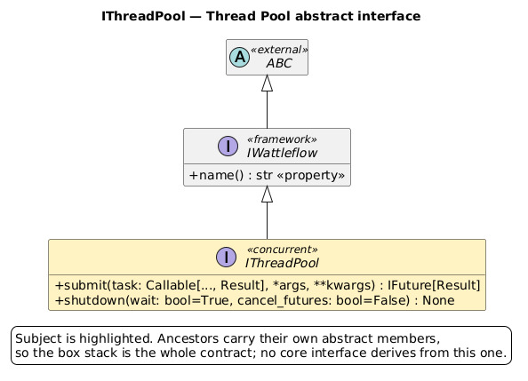

<sub>Class diagram — [source](uml/IThreadPool.puml). A view, not a source of truth (D-13).</sub>

### IWorkStealingScheduler

`wattleflow.core.concurrent.IWorkStealingScheduler` · `concurrent.py:474`

**Work-Stealing (scheduler role) abstract interface.**

Lets an idle worker steal a pending task from another worker's queue to keep
load balanced.

Inherits: `IWattleflow, ABC`

```python
def steal(self) -> Optional[Callable[..., Any]]: ...
```

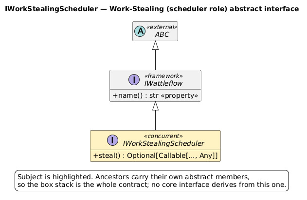

<sub>Class diagram — [source](uml/IWorkStealingScheduler.puml). A view, not a source of truth (D-13).</sub>

### IWorker

`wattleflow.core.concurrent.IWorker` · `concurrent.py:491`

**Work-Stealing (worker role) abstract interface.**

Executes tasks from its own queue and, when idle, steals from others.

Inherits: `IWattleflow, ABC`

```python
def do_work(self) -> None: ...
```


<sub>Class diagram — [source](uml/IWorker.puml). A view, not a source of truth (D-13).</sub>
