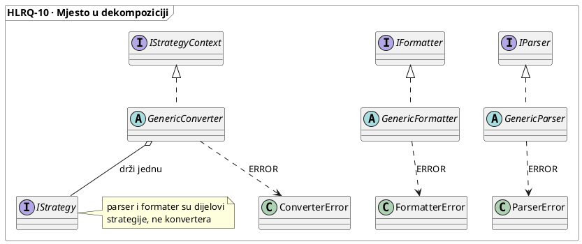

<link rel="stylesheet" href="../../requirements/styles/wattleflow.css">

# HLRQ-10-SERIALISATION — Granica formata: parser, formater i konverter (generički sloj)

| | |
|---|---|
| **Verzija** | v0.0.5 |
| **Odluka** | Tri uloge u ontologiji (`CNV`, `PAR`, `FMT`); lagana razina; konverter nije `IDriver`; granica parsera i formatera |
| **Razred** | Zahtjev visoke razine — nosi narativ i poslovna pravila; ne opisuje korake |
| **Distribucija** | `wattleflow-workflow` — clean core tier |
| **Predmet** | `workflow/src/wattleflow/concrete/serialisation.py`: `GenericParser`, `GenericFormatter`, `GenericConverter` i iznimke `ParserError`, `FormatterError`, `ConverterError` |
| **Djeca** | [`FRQ-SER-PAR`](../02-FRQ/FRQ-SER-PAR-parser.md) · [`FRQ-SER-FMT`](../02-FRQ/FRQ-SER-FMT-formatter.md) · [`FRQ-SER-CNV`](../02-FRQ/FRQ-SER-CNV-converter.md) |
| **Nadređeno** | [`HLRQ-01`](HLRQ-01-GENERIC-LAYER.md) §3 (uloge) i §4 (zajednički ugovor generičke klase) |
| **Sljedivost** | [`NFRQ-ORG-04`](../03-NFRQ/NFRQ-ORG-04-crosscutting-capability.md) · [`NFRQ-ORG-08`](../03-NFRQ/NFRQ-ORG-08-deduplication.md) · [`NFRQ-ORG-13`](../03-NFRQ/NFRQ-ORG-13-public-surface-is-the-interface.md) · [`NFRQ-SEC-03`](../03-NFRQ/NFRQ-SEC-03-supply-chain-locality.md) · [`NFRQ-OBS-01`](../03-NFRQ/NFRQ-OBS-01-audit-levels.md) · [`HLRQ-01`](HLRQ-01-GENERIC-LAYER.md) [`BR-DRV-01`](HLRQ-01-GENERIC-LAYER.md#5-poslovna-pravila), [`BR-PTN-05`](HLRQ-01-GENERIC-LAYER.md#5-poslovna-pravila) |
| **Dijagrami** | inline (§3) — pogled izveden iz koda, ne izvor istine (D-13) |

## 1. Narativ

Sučelja `IParser` i `IFormatter` ne propisuju prijenos: `parse(**kwargs)` i `render(**kwargs)`
ostavljaju izvor, odredište i tip sadržaja otvorenima. Bez sloja iznad sučelja svaka bi
specijalizacija sama otvarala izvor, odlučivala što je pogreška i kako se prijavljuje, pa bi se
ista granica formata ponašala različito od formata do formata. Konverter je treća uloga: kontekst
koji pokreće strategiju čiji su parser i formater dijelovi, a nije ni uređaj ni pohrana.

**Zašto.** Politika granice formata piše se jednom, u generičkoj klasi; specijalizacija piše samo
ono što u formatu varira (`_deserialise`, `serialise`, strategiju). Cijena je lagana razina: klase
ne nose audit, logiranje ni preset, pa kvar putuje kao iznimka s uzrokom, a ne kao zapis u
dnevniku. Mjera uspjeha je koliko malo specijalizacija mora napisati, ne koliko klasa zna.

## 2. Mjesto u dekompoziciji

```
core/            IParser · IFormatter · IStrategyContext · IStrategy         ← autoritativno
   ↑
concrete/serialisation.py   GenericParser · GenericFormatter · GenericConverter   ← OVAJ ZAHTJEV
   ↑
specijalizacije po formatu i motoru                                         ← izvan opsega
```

| uloga | smjer | sučelje | generička klasa | što piše specijalizacija | dijete |
|---|---|---|---|---|---|4
| **Parser** | pohranjeni oblik → sadržaj | `IParser` | `GenericParser` | `_deserialise` | [`FRQ-SER-PAR`](../02-FRQ/FRQ-SER-PAR-parser.md) |
| **Formatter** | sadržaj → pohranjivi oblik | `IFormatter` | `GenericFormatter` | `serialise`, `SUFFIX`, po izboru `CONTENT` | [`FRQ-SER-FMT`](../02-FRQ/FRQ-SER-FMT-formatter.md) |
| **Converter** | izvor jednog formata → teret drugog | `IStrategyContext` | `GenericConverter` | `STRATEGY`, `ERROR`, `ERRORS` | [`FRQ-SER-CNV`](../02-FRQ/FRQ-SER-CNV-converter.md) |

<p align=center>

</p>

## 3. Opseg

**U opsegu:** `concrete/serialisation.py` — tri generičke klase i tri iznimke.

**Izvan opsega:** sve izvan `workflow/src/wattleflow/concrete` — sučelja `core`, specijalizacije
parsera, formatera i konvertera te njihovi motori.

## 4. Poslovna pravila

| oznaka | pravilo |
|---|---|
| **BR-PAR-01** | Parser prima **točno jedan** izvor po pozivu: `stream` (posuđen, zatvara ga vlasnik), `path` ili `payload` (otvara i zatvara baza). Nijedan ili više od jednog odbija se prije čitanja. |
| **BR-PAR-02** | Politika izvora živi u generičkoj klasi, jednom. Specijalizacija ne otvara, ne razrješava i ne provjerava izvor; `_deserialise` prima čitač i samo opcije formata. |
| **BR-FMT-01** | Formater **vraća** teret i ništa ne zapisuje; odredište je posao pozivatelja. `stream` je pogodnost nad `render`, ne član sučelja. |
| **BR-FMT-02** | `content` je obvezan. Tip se provjerava samo ako ga specijalizacija deklarira (`CONTENT`); formati koji prihvaćaju sve ostavljaju ga neodređenim. |
| **BR-SER-01** | Kvar koji nije među `ERRORS` postaje `ERROR` s uzrokom (`raise … from`); iznimka iz `ERRORS` prolazi nepromijenjena ([`BR-PTN-05`](HLRQ-01-GENERIC-LAYER.md#5-poslovna-pravila)). `ERROR` i `ERRORS` su atributi klase: specijalizacija izvan korijena iznimki postavlja vlastitu taksonomiju. |
| **BR-CNV-01** | Konverter drži jednu strategiju i prihvaća samo `STRATEGY`. Bez strategije ili s neprikladnom odbija; pozivatelj strategije je sam konverter. |
| **BR-CNV-02** | Konverter nije `IDriver`: nema uređaja, životnog ciklusa resursa ni pohrane. Vlastitu klasu strategije opravdava transformacija između `parse` i `render`, ne izbor formatera. |
| **BR-SER-02** | Kodiranje teksta razrješava se po pozivu (`encoding=`), zatim po klasi (`ENCODING`). |
| **BR-SER-03** | Lagana razina ne nasljeđuje `Wattleflow`: bez audita, logiranja i preseta. Baze deklariraju `__slots__ = ()` da ih audit razina može kasnije kombinirati. Kontekst kvara putuje u iznimci (`caller`, `error`). |
| **BR-SER-04** | Sloj je clean core: ne uvozi treću stranu i ne poznaje motor ([`NFRQ-SEC-03`](../03-NFRQ/NFRQ-SEC-03-supply-chain-locality.md)). |

## 5. Nefunkcionalni zahtjevi

| `NFR` | posljedica za ovu sposobnost |
|---|---|
| [`NFRQ-SEC-03`](../03-NFRQ/NFRQ-SEC-03-supply-chain-locality.md) | `BR-SER-04`; import closure je `stdlib ∪ wattleflow` |
| [`NFRQ-ORG-04`](../03-NFRQ/NFRQ-ORG-04-crosscutting-capability.md) | tri uloge u zatvorenom popisu od trinaest; konverter je kontekst strategije, ne novi primitiv |
| [`NFRQ-ORG-08`](../03-NFRQ/NFRQ-ORG-08-deduplication.md) | `BR-PAR-02`, `BR-SER-01`: politika izvora i omatanja kvara na jednom mjestu |
| [`NFRQ-ORG-13`](../03-NFRQ/NFRQ-ORG-13-public-surface-is-the-interface.md) | javna površina klasa je sučelje; ostalo su kuke za specijalizaciju |
| [`NFRQ-OBS-01`](../03-NFRQ/NFRQ-OBS-01-audit-levels.md) | `BR-SER-03`: lagana razina nema `debug` trag; izuzeće je prijedlog |

**`OSCAL`:** sloj ne nosi OSCAL dekoratere ([`HLRQ-01`](HLRQ-01-GENERIC-LAYER.md) §6).

## 6. Verifikacija

Test generičkih klasa ne postoji; kriteriji djece provjereni su pregledom koda (D-11). Zatečeno
ponašanje čitano iz `serialisation.py`: točno jedan izvor, `ERROR`/`ERRORS`, `STRATEGY`,
`check` i `encoding` po pozivu.

## 7. Otvoreno

1. **Slotovi nisu učinkoviti.** Sučelja `core` ne deklariraju `__slots__ = ()`, pa `GenericConverter`
   drži `_strategy` u `__dict__` ([`FRQ-SER-CNV`](../02-FRQ/FRQ-SER-CNV-converter.md) §11 t.2); zahvat je u `core`.
2. **`GenericConverter.__init__` ne zove `super().__init__`** ([`FRQ-SER-CNV`](../02-FRQ/FRQ-SER-CNV-converter.md) §11 t.1).

## Povijest promjena

| Verzija | Datum | Promjena |
|---|---|---|
| v0.0.5 | 2026-10-06 | Kuka parsera je zaštićena `_deserialise` (`NFRQ-ORG-13` k.2). |
| v0.0.5 | 2026-10-02 | `Verzija` zamjenjuje `Status`; prijašnji status: Provedeno u kodu — lagana razina |
